# Infralyzer Architecture Guide

## 🏗️ System Architecture Overview

This document provides a comprehensive overview of Infralyzer's architecture, design patterns, and component interactions.

## 🎯 Architecture Principles

### Core Design Philosophy

Infralyzer is built on the following architectural principles:

1. **🎯 Layered Architecture**: Clear separation of concerns across distinct layers
2. **🔌 Pluggable Components**: Interchangeable engines and modules
3. **🧠 AI-First Design**: Native AI integration throughout the platform
4. **📈 Horizontal Scalability**: Designed for growing data volumes
5. **⚡ Performance Optimization**: Smart caching and query optimization
6. **🛡️ Enterprise Security**: Comprehensive authentication and authorization

## 🏛️ System Layers

### 1. Data Source Layer

**Purpose**: Interface with external data sources

```mermaid
graph LR
    subgraph "External Data Sources"
        S3[AWS S3<br/>CUR Exports]
        Pricing[AWS Pricing API<br/>Real-time Rates]
        Savings[AWS Savings Plans API<br/>Discount Data]
    end

    subgraph "Data Managers"
        S3Manager[S3 Data Manager<br/>🔄 Sync & Discovery]
        PricingManager[Pricing Manager<br/>💰 Rate Management]
        LocalManager[Local Manager<br/>💾 Cache Control]
    end

    S3 --> S3Manager
    Pricing --> PricingManager
    Savings --> PricingManager

    S3Manager --> LocalManager
    PricingManager --> LocalManager

    classDef external fill:#e1f5fe,stroke:#01579b,stroke-width:2px
    classDef manager fill:#f3e5f5,stroke:#4a148c,stroke-width:2px

    class S3,Pricing,Savings external
    class S3Manager,PricingManager,LocalManager manager
```



**Components:**

- **S3 Data Manager**: Handles CUR data discovery, partitioning, and synchronization
- **API Data Manager**: Manages AWS Pricing and Savings Plans API integration
- **Local Data Manager**: Controls local caching for cost optimization

### 2. Query Engine Layer

**Purpose**: Execute SQL queries across different engines

```mermaid
graph TB
    subgraph "Query Engine Factory"
        Factory[Engine Factory<br/>🏭 Router]
    end

    subgraph "Query Engines"
        DuckDB[DuckDB Engine<br/>⚡ OLAP Analytics]
        Polars[Polars Engine<br/>🚀 DataFrames]
        Athena[Athena Engine<br/>☁️ Serverless]
    end

    subgraph "Engine Capabilities"
        subgraph "DuckDB Features"
            D1[Columnar Storage]
            D2[Complex SQL]
            D3[Local Processing]
        end

        subgraph "Polars Features"
            P1[Lazy Evaluation]
            P2[Memory Efficiency]
            P3[Modern API]
        end

        subgraph "Athena Features"
            A1[Unlimited Scale]
            A2[No Infrastructure]
            A3[AWS Integration]
        end
    end

    Factory --> DuckDB
    Factory --> Polars
    Factory --> Athena

    DuckDB --> D1
    DuckDB --> D2
    DuckDB --> D3

    Polars --> P1
    Polars --> P2
    Polars --> P3

    Athena --> A1
    Athena --> A2
    Athena --> A3

    classDef factory fill:#fff3e0,stroke:#e65100,stroke-width:2px
    classDef engine fill:#e8f5e8,stroke:#1b5e20,stroke-width:2px
    classDef feature fill:#f1f8e9,stroke:#33691e,stroke-width:1px

    class Factory factory
    class DuckDB,Polars,Athena engine
    class D1,D2,D3,P1,P2,P3,A1,A2,A3 feature
```



**Engine Selection Logic:**

- **DuckDB**: Default for fast analytics, complex SQL operations
- **Polars**: Modern DataFrame operations, memory-efficient processing
- **Athena**: Massive datasets, serverless scalability requirements

### 3. Core Engine Layer

**Purpose**: Unified interface for all functionality

```mermaid
graph TB
    subgraph "FinOps Engine"
        Core[FinOps Engine<br/>🎯 Main Controller]
        Config[Data Config<br/>⚙️ Configuration]
    end

    subgraph "Analytics Modules"
        KPI[KPI Analytics<br/>📊 Dashboards]
        Spend[Spend Analytics<br/>💰 Costs]
        Optimization[Optimization<br/>🔍 Recommendations]
        Allocation[Allocation<br/>🏷️ Tags]
        Discounts[Discounts<br/>💳 Savings]
        AI[AI Analytics<br/>🤖 ML Insights]
    end

    subgraph "Module Capabilities"
        subgraph "KPI Features"
            K1[Real-time Metrics]
            K2[Executive Dashboard]
            K3[Cost Trends]
        end

        subgraph "AI Features"
            AI1[Anomaly Detection]
            AI2[Forecasting]
            AI3[Recommendations]
        end
    end

    Core --> Config
    Core --> KPI
    Core --> Spend
    Core --> Optimization
    Core --> Allocation
    Core --> Discounts
    Core --> AI

    KPI --> K1
    KPI --> K2
    KPI --> K3

    AI --> AI1
    AI --> AI2
    AI --> AI3

    classDef core fill:#fce4ec,stroke:#880e4f,stroke-width:2px
    classDef module fill:#e0f2f1,stroke:#00695c,stroke-width:2px
    classDef capability fill:#f8e0f8,stroke:#6a1b9a,stroke-width:1px

    class Core,Config core
    class KPI,Spend,Optimization,Allocation,Discounts,AI module
    class K1,K2,K3,AI1,AI2,AI3 capability
```



### 4. AI Integration Layer (NEW!)

**Purpose**: Advanced AI capabilities with AWS Bedrock

```mermaid
graph TB
    subgraph "Bedrock Integration"
        Handler[Bedrock Handler<br/>🧠 AI Controller]
        ModelMgmt[Model Management<br/>⚙️ Configuration]
        KBMgmt[Knowledge Base<br/>📚 Context]
    end

    subgraph "AI Models"
        Claude[Claude 3.5 Sonnet<br/>🎯 Complex Reasoning]
        Haiku[Claude 3 Haiku<br/>⚡ Fast Queries]
        Titan[Amazon Titan<br/>💰 Cost Effective]
        Cohere[Cohere Command<br/>💬 Conversations]
        Llama[Meta Llama<br/>🌐 Open Source]
    end

    subgraph "AI Capabilities"
        Chat[Conversational AI<br/>💬 Natural Dialogue]
        QueryGen[Query Generation<br/>🔍 NL to SQL]
        Insights[Intelligent Insights<br/>💡 Recommendations]
        Citations[Source Citations<br/>📖 Transparency]
    end

    subgraph "Knowledge System"
        Vector[Vector Embeddings<br/>🧮 Semantic Search]
        Search[Vector Search<br/>🔍 Context Retrieval]
        Sources[Source Attribution<br/>📊 Data Lineage]
    end

    Handler --> ModelMgmt
    Handler --> KBMgmt

    ModelMgmt --> Claude
    ModelMgmt --> Haiku
    ModelMgmt --> Titan
    ModelMgmt --> Cohere
    ModelMgmt --> Llama

    Handler --> Chat
    Handler --> QueryGen
    Handler --> Insights
    Handler --> Citations

    KBMgmt --> Vector
    KBMgmt --> Search
    KBMgmt --> Sources

    Claude --> QueryGen
    Haiku --> Chat
    Titan --> Insights

    classDef bedrock fill:#e3f2fd,stroke:#1976d2,stroke-width:2px
    classDef model fill:#fff3e0,stroke:#f57c00,stroke-width:2px
    classDef capability fill:#e8f5e8,stroke:#2e7d32,stroke-width:2px
    classDef knowledge fill:#f3e5f5,stroke:#7b1fa2,stroke-width:2px

    class Handler,ModelMgmt,KBMgmt bedrock
    class Claude,Haiku,Titan,Cohere,Llama model
    class Chat,QueryGen,Insights,Citations capability
    class Vector,Search,Sources knowledge
```



### 5. API Layer

**Purpose**: REST API interface for all functionality


## 🔄 Data Flow Patterns

### Pattern 1: Traditional SQL Query


### Pattern 2: AI-Powered Query Generation


### Pattern 3: Knowledge Base Chat


## 🔧 Configuration Management

### Environment-Based Configuration

```python
# Development
config = DataConfig(
    s3_bucket='dev-cost-bucket',
    local_data_path='./dev_cache',
    aws_profile='finops-dev'
)

# Production
config = DataConfig(
    s3_bucket=os.environ['PROD_S3_BUCKET'],
    role_arn=os.environ['FINOPS_ROLE_ARN'],
    local_data_path='/opt/finops/cache'
)
```

### Engine Selection Strategy

```python
def select_engine(query_complexity: str, data_size: str) -> str:
    if data_size == "massive" and query_complexity == "simple":
        return "athena"
    elif query_complexity == "complex":
        return "duckdb"
    else:
        return "polars"
```

## 📊 Performance Considerations

### Caching Strategy

1. **L1 Cache**: In-memory query result cache (fastest)
2. **L2 Cache**: Local parquet files (fast, persistent)
3. **L3 Cache**: S3 data source (slowest, authoritative)

### Query Optimization

1. **Predicate Pushdown**: Filter data at source
2. **Partition Pruning**: Limit scanned partitions
3. **Engine Selection**: Choose optimal engine per query
4. **Result Caching**: Cache expensive computations

## 🛡️ Security Architecture

### Authentication Flow


### Authorization Model

- **Admin**: Full system access, configuration management
- **Analyst**: Query execution, report generation
- **Viewer**: Read-only access to pre-built reports
- **API**: Programmatic access with scope limitations

## 🚀 Deployment Patterns

### Single-Node Deployment

```yaml
# docker-compose.yml
services:
  infralyzer:
    image: infralyzer:latest
    environment:
      - FINOPS_S3_BUCKET=my-cur-bucket
      - FINOPS_ENGINE=duckdb
    volumes:
      - ./cache:/app/cache
    ports:
      - "8000:8000"
```

### Kubernetes Deployment

```yaml
apiVersion: apps/v1
kind: Deployment
metadata:
  name: infralyzer
spec:
  replicas: 3
  template:
    spec:
      containers:
        - name: infralyzer
          image: infralyzer:latest
          env:
            - name: FINOPS_S3_BUCKET
              valueFrom:
                secretKeyRef:
                  name: finops-config
                  key: s3-bucket
```

## 🔮 Future Architecture Considerations

### Planned Enhancements

1. **Distributed Query Engine**: Multi-node DuckDB clusters
2. **Real-time Streaming**: Apache Kafka integration for live data
3. **Advanced ML Pipeline**: Custom model training and inference
4. **Multi-Cloud Support**: Azure and GCP cost data integration
5. **Graph Analytics**: Cost relationship and dependency analysis

### Scalability Roadmap

- **Phase 1**: Vertical scaling with larger instances
- **Phase 2**: Horizontal scaling with read replicas
- **Phase 3**: Distributed architecture with query coordination
- **Phase 4**: Multi-region deployment with data locality

---

This architecture enables Infralyzer to provide enterprise-grade FinOps analytics with modern AI capabilities while maintaining flexibility, performance, and scalability.
