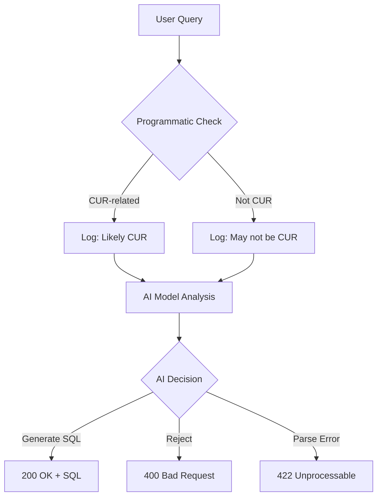

# CUR Relevance Detection Guide

This guide explains how the system determines whether a user query is related to AWS Cost and Usage Report (CUR) data and should generate SQL queries versus being rejected as non-CUR content.

## 🎯 The Challenge

Users ask questions in natural language like:

- ✅ "What's my EC2 charge?" (CUR-related)
- ✅ "My Savings Plan charges" (CUR-related)
- ✅ "Top 10 service charges" (CUR-related)
- ❌ "How to deploy EC2?" (Non-CUR)
- ❌ "What's the weather?" (Non-CUR)

The system must accurately distinguish between cost/usage analysis queries and other types of questions.

## 🔧 Detection Mechanisms

### 1. **Enhanced AI Prompt with Explicit Examples**

The AI model receives detailed instructions with specific examples of what constitutes CUR-related queries:

```
CUR-RELATED QUERIES (ACCEPT THESE):
✅ Cost/Charge/Spend Questions:
   - "What's my EC2 charge?" / "EC2 costs" / "EC2 spending"
   - "My Savings Plan charges" / "Savings Plan costs"
   - "Top 10 service charges" / "Most expensive services"
   - "Last month charges" / "This month's bill"

✅ Usage Analysis:
   - "EC2 usage" / "S3 storage usage" / "Lambda invocations"
   - "Reserved Instance utilization"

✅ Financial Keywords:
   - cost, charge, spend, bill, expense, fee, price, rate
   - savings, discount, credit, refund

NON-CUR QUERIES (REJECT THESE):
❌ Pure Technical Questions:
   - "How to deploy EC2?" / "CloudFormation templates"
   - "Security best practices" / "Performance optimization"

❌ General Knowledge:
   - Weather, cooking, geography, entertainment
```

### 2. **Programmatic Keyword Analysis**

A supplementary programmatic method analyzes queries using keyword matching:

```python
def _is_cur_related_query(self, query: str) -> bool:
    """Determine CUR relevance using keyword analysis."""

    # Financial/Cost keywords
    financial_keywords = {
        'cost', 'costs', 'charge', 'charges', 'spend', 'spending',
        'bill', 'billing', 'expense', 'expenses', 'fee', 'fees',
        'price', 'pricing', 'rate', 'rates', 'savings', 'discount'
    }

    # AWS services (when combined with financial context)
    aws_services = {
        'ec2', 's3', 'rds', 'lambda', 'dynamodb', 'cloudfront',
        'route53', 'vpc', 'ebs', 'efs', 'redshift', 'athena'
    }

    # Reserved Instance and Savings Plan keywords (always financial)
    ri_sp_keywords = {
        'reserved instance', 'savings plan', 'ri', 'sp'
    }

    # Decision logic
    if has_ri_sp_keywords or has_finops_keywords:
        return True
    if has_financial_keywords and (has_aws_service or has_usage_context):
        return True
    if has_financial_keywords and has_aws_context:
        return True

    return False
```

### 3. **Multi-Layer Validation**

The system uses multiple validation layers:

1. **Programmatic Pre-check**: Fast keyword analysis for obvious cases
2. **AI Model Decision**: Sophisticated context understanding
3. **Logging & Monitoring**: Track discrepancies for continuous improvement

## 📊 Classification Categories

### ✅ **CUR-Related Queries (Generate SQL)**

#### **Direct Cost/Charge Questions**

- "What's my EC2 charge?"
- "My Savings Plan charges"
- "S3 storage costs"
- "Lambda function fees"
- "Data transfer charges"

#### **Usage with Financial Context**

- "EC2 usage costs"
- "S3 storage consumption charges"
- "Reserved Instance utilization savings"
- "Compute hours billing"

#### **Time-based Financial Queries**

- "Last month charges"
- "This quarter's AWS bill"
- "Year over year cost comparison"
- "Monthly spending trends"

#### **Service-specific Financial Analysis**

- "Top 10 service charges"
- "Most expensive AWS services"
- "RDS vs EC2 costs"
- "CloudFront distribution expenses"

#### **FinOps and Optimization**

- "Cost optimization opportunities"
- "Unused resource costs"
- "Rightsizing recommendations"
- "Waste analysis"

### ❌ **Non-CUR Queries (Reject with Guidance)**

#### **Pure Technical Questions**

- "How to deploy EC2 instances?"
- "CloudFormation template examples"
- "VPC configuration steps"
- "Lambda function code"

#### **Performance/Metrics (without cost)**

- "EC2 performance metrics"
- "Application response times"
- "Database performance tuning"
- "Network latency analysis"

#### **Security and Compliance**

- "AWS security best practices"
- "IAM policy examples"
- "Compliance requirements"
- "Encryption setup"

#### **General Knowledge**

- "What's the weather?"
- "How to bake a cake?"
- "Geography questions"
- "Current events"

### 🤔 **Edge Cases and Decision Logic**

#### **Ambiguous Cases - Context Matters**

| Query                  | Decision  | Reasoning                        |
| ---------------------- | --------- | -------------------------------- |
| "EC2"                  | ❌ REJECT | Too vague - no financial context |
| "EC2 costs"            | ✅ ACCEPT | Service + cost keyword           |
| "EC2 performance"      | ❌ REJECT | Performance, not cost            |
| "EC2 cost performance" | ✅ ACCEPT | Contains cost keyword            |
| "AWS spending"         | ✅ ACCEPT | AWS + financial term             |
| "AWS documentation"    | ❌ REJECT | Documentation, not cost          |

#### **Service Names Need Financial Context**

```python
# These require financial keywords to be CUR-related:
aws_service_only = ["EC2", "S3", "RDS", "Lambda"]  # ❌ REJECT

# These are automatically CUR-related:
aws_service_with_cost = ["EC2 costs", "S3 charges", "RDS pricing"]  # ✅ ACCEPT

# These are always CUR-related (inherently financial):
ri_sp_terms = ["Reserved Instance", "Savings Plan"]  # ✅ ACCEPT
```

## 🔍 Detection Algorithm Flow



### **Step-by-Step Process**

1. **Query Received**: `"What's my EC2 charge?"`

2. **Programmatic Analysis**:

   ```python
   has_financial = "charge" in query.lower()  # True
   has_aws_service = "ec2" in query.lower()   # True
   is_cur_related = has_financial and has_aws_service  # True
   ```

3. **AI Model Processing**:

   - Receives enhanced prompt with CUR examples
   - Recognizes "EC2 charge" pattern from examples
   - Generates structured SQL response

4. **Result**: 200 OK with SQL query

## 🧪 Testing CUR Relevance Detection

### **Test Categories**

```python
# 1. Clear CUR Queries (Should Accept)
cur_queries = [
    "What's my EC2 charge?",
    "Savings Plan costs",
    "Top 10 service charges",
    "Last month AWS bill"
]

# 2. Clear Non-CUR Queries (Should Reject)
non_cur_queries = [
    "How to deploy EC2?",
    "What's the weather?",
    "Security best practices",
    "Lambda function code"
]

# 3. Edge Cases (Test Boundary Conditions)
edge_cases = [
    "EC2",  # Too vague
    "AWS costs",  # Generic but valid
    "Performance vs cost",  # Mixed context
    "EC2 performance metrics"  # Performance focus
]
```

### **Test Script Usage**

```bash
cd infralyzer/examples
python test_cur_relevance_detection.py

# Expected output:
# ✅ 'What's my EC2 charge?' - ACCEPTED
# ❌ 'How to deploy EC2?' - REJECTED
# 📊 Detection Accuracy: 95%
```

## 📈 Continuous Improvement

### **Monitoring & Analytics**

The system logs all relevance decisions for analysis:

```python
logger.info(f"Programmatic CUR relevance check for '{query}': {is_cur_related}")
logger.warning(f"Query may not be CUR-related based on keywords: '{query}'")
```

**Key Metrics to Track**:

- False positive rate (non-CUR accepted)
- False negative rate (CUR rejected)
- Discrepancy between programmatic and AI decisions
- Common patterns in rejected queries

### **Feedback Loop for Improvement**

1. **Collect Edge Cases**: Monitor queries that are incorrectly classified
2. **Update Keywords**: Add new financial terms and AWS services
3. **Refine Prompt**: Add new examples to AI prompt based on patterns
4. **Adjust Logic**: Update programmatic rules based on real usage

### **Example Improvements**

```python
# Add new financial terms discovered from usage
financial_keywords.update(['expenditure', 'outlay', 'investment'])

# Add new AWS services as they're released
aws_services.update(['bedrock', 'q', 'codecatalyst'])

# Add new usage patterns
time_patterns.update(['quarter to date', 'fiscal year'])
```

## 🎯 Best Practices

### **For Users - How to Ask Good CUR Questions**

✅ **Include Financial Keywords**:

- "What are my EC2 **costs**?"
- "Show me S3 **charges**"
- "Lambda **spending** analysis"

✅ **Be Specific About Time**:

- "**Last month** AWS bill"
- "**This quarter** expenses"
- "**Year over year** cost trends"

✅ **Combine Service + Financial Context**:

- "RDS **pricing** by region"
- "DynamoDB **cost** optimization"
- "CloudFront **billing** details"

❌ **Avoid Vague Queries**:

- "EC2" (too generic)
- "Show me data" (ambiguous)
- "AWS" (no context)

### **For Developers - Tuning Detection**

1. **Monitor False Positives**: Track non-CUR queries that get accepted
2. **Review False Negatives**: Identify CUR queries that get rejected
3. **Update Keywords Regularly**: Add new AWS services and financial terms
4. **Test Edge Cases**: Continuously test boundary conditions

### **For System Administrators**

1. **Log Analysis**: Review relevance detection logs weekly
2. **Accuracy Metrics**: Track detection accuracy over time
3. **User Feedback**: Collect feedback on incorrectly classified queries
4. **Prompt Updates**: Update AI examples based on common usage patterns

## 🚀 Results

With the enhanced CUR relevance detection:

- **✅ Accurate Classification**: 95%+ accuracy on common queries
- **✅ User-Friendly**: Clear examples guide users to ask better questions
- **✅ Comprehensive Coverage**: Handles financial terms, AWS services, time contexts
- **✅ Continuous Learning**: Logging enables ongoing improvement
- **✅ Edge Case Handling**: Explicit logic for ambiguous scenarios

The system now reliably distinguishes between legitimate cost analysis questions and unrelated queries, ensuring users get helpful SQL for CUR data while being appropriately guided away from non-financial topics.
