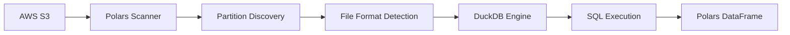

# DE Polars

**Advanced SQL interface for AWS Data Exports powered by DuckDB with high-performance partition-aware querying.**

Query AWS Cost and Usage Reports (CUR), FOCUS data, Cost Optimization Hub recommendations, and Carbon Emissions data using advanced SQL features including window functions, CTEs, complex joins, and more through the DuckDB SQL engine.

## 🎯 Supported Data Exports

- **CUR 2.0** - Cost and Usage Reports (`BILLING_PERIOD=YYYY-MM`, monthly)
- **FOCUS 1.0** - FinOps specification (`billing_period=YYYY-MM`, monthly)
- **COH** - Cost Optimization Hub (`date=YYYY-MM-DD`, daily)
- **Carbon Emissions** - Environmental impact (`BILLING_PERIOD=YYYY-MM`, monthly)

## 📁 File Format Support

- **Parquet files** (`.parquet`) - Optimized columnar format for fast querying
- **Gzip files** (`.gz`) - Compressed CSV format (automatically detected and decompressed)

## 🧠 Advanced SQL Engine (DuckDB)

Powered by **DuckDB**, this package supports advanced SQL features that go beyond basic querying:

### 🪟 **Window Functions**

```sql
SELECT
    product_servicecode,
    line_item_unblended_cost,
    SUM(line_item_unblended_cost) OVER (
        PARTITION BY product_servicecode
        ORDER BY line_item_usage_start_date
    ) as running_total
FROM CUR
```

### 📊 **Common Table Expressions (CTEs)**

```sql
WITH monthly_costs AS (
    SELECT
        DATE_TRUNC('month', line_item_usage_start_date) as month,
        product_servicecode,
        SUM(line_item_unblended_cost) as monthly_cost
    FROM CUR
    GROUP BY 1, 2
)
SELECT * FROM monthly_costs WHERE monthly_cost > 100
```

### 🔄 **Complex Joins & Subqueries**

```sql
SELECT a.*, b.avg_cost
FROM CUR a
JOIN (
    SELECT product_servicecode, AVG(line_item_unblended_cost) as avg_cost
    FROM CUR GROUP BY product_servicecode
) b ON a.product_servicecode = b.product_servicecode
```

### 📅 **Advanced Date Functions**

```sql
SELECT
    DATE_TRUNC('week', line_item_usage_start_date) as week,
    EXTRACT(dow FROM line_item_usage_start_date) as day_of_week,
    COUNT(*) as records
FROM CUR
GROUP BY 1, 2
```

## 🔗 Polars + DuckDB Integration Architecture

This package combines the strengths of **Polars** and **DuckDB** to create a powerful, efficient analytics platform:

### **🎯 How They Work Together**



### **🔧 Technology Roles**

| Technology | Responsibility                     | Why?                                                                                                                                                      |
| ---------- | ---------------------------------- | --------------------------------------------------------------------------------------------------------------------------------------------------------- |
| **Polars** | S3 Data Discovery & Authentication | • Efficient S3 scanning<br>• AWS credential integration<br>• Partition-aware file discovery<br>• Format detection (Parquet/Gzip)                          |
| **DuckDB** | SQL Query Execution                | • Advanced SQL features (CTEs, window functions)<br>• High-performance columnar processing<br>• Complex join optimization<br>• Standard SQL compatibility |

### **⚡ Integration Benefits**

#### **1. Efficient Data Loading (Polars)**

- **Partition-aware discovery**: Only scans needed S3 partitions
- **Format optimization**: Automatic Parquet vs Gzip detection
- **Credential management**: Seamless AWS authentication via Boto3
- **Memory efficiency**: Lazy evaluation for large datasets

#### **2. Advanced SQL Processing (DuckDB)**

- **Full SQL standard**: Window functions, CTEs, complex joins
- **Performance**: Vectorized query execution
- **Compatibility**: Works with existing SQL tools and knowledge
- **Analytics**: Built-in statistical and analytical functions

#### **3. Unified API**

- **Simple interface**: One `query()` method for all SQL operations
- **Polars output**: Results returned as familiar Polars DataFrames
- **Transparent**: Users don't need to know about the dual architecture
- **Consistent**: Same API across different AWS Data Export types

### **🚀 Data Flow Example**

```python
# 1. Initialize with S3 data location
data = DataExportsPolars(
    s3_bucket='billing-data-exports-cur',
    s3_data_prefix='cur2/cur2/data',
    data_export_type='CUR2.0',
    date_start='2025-07'  # Polars: Partition-aware discovery
)

# 2. Execute advanced SQL query
result = data.query("""
    -- DuckDB: Advanced SQL processing
    WITH monthly_costs AS (
        SELECT
            DATE_TRUNC('month', line_item_usage_start_date) as month,
            product_servicecode,
            SUM(line_item_unblended_cost) as cost
        FROM CUR
        GROUP BY 1, 2
    )
    SELECT
        product_servicecode,
        AVG(cost) OVER (ORDER BY month) as rolling_avg
    FROM monthly_costs
""")  # Returns: Polars DataFrame
```

### **🏗️ Why This Architecture?**

**Best of Both Worlds:**

- **Polars**: Excels at I/O operations and data loading efficiency
- **DuckDB**: Excels at complex SQL analytics and query optimization

**Performance Optimized:**

- Only load data once (Polars handles S3 efficiently)
- DuckDB processes in-memory for maximum speed
- Partition pruning reduces data transfer costs

**Developer Friendly:**

- Familiar SQL syntax (DuckDB standard compliance)
- Simple Python API (Polars DataFrame ecosystem)
- Automatic optimizations (no manual tuning required)

## 📦 Installation

```bash
pip install git+https://github.com/jasonwu001t/de-polars.git
```

**Requirements:** Python 3.8+, AWS credentials configured

**Dependencies:** DuckDB 0.9.0+, Polars 0.18.0+, Boto3 1.26.0+

## 🚀 Quick Start

### Basic Usage

```python
from de_polars import DataExportsPolars

# CUR 2.0 data (monthly partitions)
cur_data = DataExportsPolars(
    s3_bucket='your-bucket',
    s3_data_prefix='cur2/cur2/data',     # Exact path to data directory
    data_export_type='CUR2.0',          # Auto-selects BILLING_PERIOD= format
    date_start='2025-07',                # YYYY-MM format
    date_end='2025-07'
)

# FOCUS 1.0 data (monthly partitions)
focus_data = DataExportsPolars(
    s3_bucket='your-bucket',
    s3_data_prefix='focus1/focus1/data', # Exact path to data directory
    data_export_type='FOCUS1.0',        # Auto-selects billing_period= format
    table_name='FOCUS',
    date_start='2025-07',
    date_end='2025-07'
)

# COH data (daily partitions)
coh_data = DataExportsPolars(
    s3_bucket='your-bucket',
    s3_data_prefix='coh/coh/data',       # Exact path to data directory
    data_export_type='COH',             # Auto-selects date= format
    table_name='RECOMMENDATIONS',
    date_start='2025-07-15',            # YYYY-MM-DD format
    date_end='2025-07-20'
)

# Query with SQL (works with both Parquet and Gzip files automatically)
result = cur_data.query("""
    SELECT product_servicecode, SUM(line_item_unblended_cost) as total_cost
    FROM CUR
    WHERE line_item_unblended_cost > 0
    GROUP BY product_servicecode
    ORDER BY total_cost DESC
    LIMIT 10
""")
print(result)

# Note: File format is automatically detected and handled
# - Parquet files: Optimized columnar scanning
# - Gzip files: CSV scanning with automatic decompression
```

### Find Your S3 Path

```bash
# Find your data location
aws s3 ls s3://your-bucket/ --recursive | grep parquet

# Common structures:
# s3://bucket/cur2/cur2/data/BILLING_PERIOD=2025-01/
# s3://bucket/focus1/focus1/data/billing_period=2025-01/
# s3://bucket/coh/coh/data/date=2025-07-15/
```

## 📊 API Reference

### DataExportsPolars Constructor

```python
DataExportsPolars(
    s3_bucket: str,                      # S3 bucket name
    s3_data_prefix: str,                 # Path to data directory
    data_export_type: str,               # 'CUR2.0' | 'FOCUS1.0' | 'COH' | 'CARBON_EMISSION'
    table_name: str = "CUR",             # SQL table name
    date_start: str = None,              # YYYY-MM or YYYY-MM-DD (depends on export type)
    date_end: str = None,                # YYYY-MM or YYYY-MM-DD (depends on export type)

    # AWS Authentication (optional)
    aws_region: str = None,
    aws_access_key_id: str = None,
    aws_secret_access_key: str = None,
    aws_session_token: str = None,
    aws_profile: str = None,
    role_arn: str = None,
    external_id: str = None
)
```

### Main Methods

| Method                        | Description               | Example                                    |
| ----------------------------- | ------------------------- | ------------------------------------------ |
| `query(sql)`                  | Execute SQL query         | `data.query("SELECT * FROM CUR LIMIT 10")` |
| `schema()`                    | Get column schema         | `data.schema()`                            |
| `catalog()`                   | Get data catalog info     | `data.catalog()`                           |
| `sample(n)`                   | Get sample rows           | `data.sample(100)`                         |
| `info()`                      | Print data summary        | `data.info()`                              |
| `list_available_partitions()` | Debug partition discovery | `data.list_available_partitions()`         |

### Data Partitioning

```python
from de_polars import DataPartitioner

# Create partitioned datasets
partitioner = DataPartitioner(
    source_client=cur_data,
    target_bucket='your-bucket',
    target_prefix='partitioned-data'
)

# SQL-based partitioning
high_cost_path = partitioner.example_1_sql_partition()

# Python-based partitioning
ec2_path = partitioner.example_2_python_partition()
```

## 🔐 Authentication

DE Polars supports multiple AWS authentication methods:

### Environment Variables (Recommended)

```bash
export AWS_ACCESS_KEY_ID="your-key"
export AWS_SECRET_ACCESS_KEY="your-secret"
export AWS_DEFAULT_REGION="us-east-1"
```

### AWS Profiles

```python
DataExportsPolars(
    s3_bucket='bucket',
    s3_data_prefix='path/data',
    data_export_type='CUR2.0',
    aws_profile='my-profile'
)
```

### Cross-Account Roles

```python
DataExportsPolars(
    s3_bucket='bucket',
    s3_data_prefix='path/data',
    data_export_type='CUR2.0',
    role_arn='arn:aws:iam::123456789012:role/CrossAccountRole',
    external_id='unique-id'
)
```

## ⚡ Performance Optimization

### 1. Use Date Filters (10x faster)

```python
# ✅ Good - scans only needed partitions
data = DataExportsPolars(
    s3_bucket='bucket',
    s3_data_prefix='cur2/cur2/data',
    data_export_type='CUR2.0',
    date_start='2025-07',               # Only scans BILLING_PERIOD=2025-07/
    date_end='2025-07'
)

# ❌ Slow - scans all partitions
data = DataExportsPolars(
    s3_bucket='bucket',
    s3_data_prefix='cur2/cur2/data',
    data_export_type='CUR2.0'
    # No date filters = loads all data
)
```

### 2. Select Specific Columns

```python
# ✅ Good
result = data.query("SELECT service, cost FROM CUR WHERE cost > 100")

# ❌ Slow
result = data.query("SELECT * FROM CUR WHERE cost > 100")
```

### 3. Use Efficient Filters

```python
# ✅ Good - filter early
result = data.query("""
    SELECT service, SUM(cost)
    FROM CUR
    WHERE cost > 0 AND service = 'EC2'
    GROUP BY service
""")
```

## 🆘 Troubleshooting

### Common Issues

**"Invalid data_export_type"**

- Use: `'CUR2.0'`, `'FOCUS1.0'`, `'COH'`, or `'CARBON_EMISSION'`

**"No files found in partition"**

- Check S3 path: `aws s3 ls s3://bucket/prefix/`
- Verify date format: CUR/FOCUS use `YYYY-MM`, COH uses `YYYY-MM-DD`
- Run: `data.list_available_partitions()`

**"Access Denied"**

- Check AWS credentials: `aws s3 ls s3://your-bucket/`
- Verify IAM permissions for S3 read access

**"unsupported function"**

- Use Polars-compatible SQL functions
- Replace `DATE_TRUNC` with `::date` casting

**Poor Performance**

- Add date filters: `date_start='2025-07'`
- Select specific columns instead of `SELECT *`
- Use smaller date ranges for initial testing

## 📝 Examples

### Cost Analysis

```python
# Top services by cost
result = data.query("""
    SELECT
        product_servicecode,
        SUM(line_item_unblended_cost) as total_cost,
        COUNT(*) as line_items
    FROM CUR
    WHERE line_item_unblended_cost > 0
    GROUP BY product_servicecode
    ORDER BY total_cost DESC
    LIMIT 10
""")
```

### Monthly Trends

```python
# Monthly cost trends
result = data.query("""
    SELECT
        line_item_usage_start_date::date as usage_date,
        SUM(line_item_unblended_cost) as daily_cost
    FROM CUR
    WHERE line_item_unblended_cost > 0
    GROUP BY usage_date
    ORDER BY usage_date
""")
```

### FOCUS Analysis

```python
# FOCUS service costs
result = focus_data.query("""
    SELECT
        ServiceName,
        SUM(BilledCost) as total_cost
    FROM FOCUS
    WHERE BilledCost > 0
    GROUP BY ServiceName
    ORDER BY total_cost DESC
""")
```

### COH Recommendations

```python
# Cost optimization opportunities
result = coh_data.query("""
    SELECT
        recommendation_type,
        COUNT(*) as recommendation_count,
        SUM(estimated_monthly_savings_amount) as total_savings
    FROM RECOMMENDATIONS
    WHERE estimated_monthly_savings_amount > 0
    GROUP BY recommendation_type
    ORDER BY total_savings DESC
""")
```

## 🤝 Contributing

1. Fork the repository
2. Create a feature branch
3. Make changes with tests
4. Submit a pull request

## 📄 License

MIT License - see LICENSE file for details.
