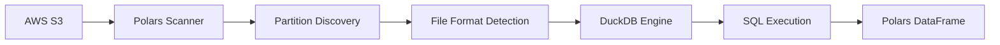

# DE Polars

**Advanced SQL interface for AWS Data Exports powered by DuckDB with high-performance partition-aware querying.**

Query AWS Cost and Usage Reports (CUR), FOCUS data, Cost Optimization Hub recommendations, and Carbon Emissions data using advanced SQL features including window functions, CTEs, complex joins, and more through the DuckDB SQL engine.

## 🎯 Supported Data Exports

- **CUR 2.0** - Cost and Usage Reports (`BILLING_PERIOD=YYYY-MM`, monthly)
- **FOCUS 1.0** - FinOps specification (`billing_period=YYYY-MM`, monthly)
- **COH** - Cost Optimization Hub (`date=YYYY-MM-DD`, daily)
- **Carbon Emissions** - Environmental impact (`BILLING_PERIOD=YYYY-MM`, monthly)

## 📁 File Format Support

- **Parquet files** (`.parquet`) - Optimized columnar format for fast querying
- **Gzip files** (`.gz`) - Compressed CSV format (automatically detected and decompressed)

## 🧠 Advanced SQL Engine (DuckDB)

Powered by **DuckDB**, this package supports advanced SQL features that go beyond basic querying:

### 🪟 **Window Functions**

```sql
SELECT
    product_servicecode,
    line_item_unblended_cost,
    SUM(line_item_unblended_cost) OVER (
        PARTITION BY product_servicecode
        ORDER BY line_item_usage_start_date
    ) as running_total
FROM CUR
```

### 📊 **Common Table Expressions (CTEs)**

```sql
WITH monthly_costs AS (
    SELECT
        DATE_TRUNC('month', line_item_usage_start_date) as month,
        product_servicecode,
        SUM(line_item_unblended_cost) as monthly_cost
    FROM CUR
    GROUP BY 1, 2
)
SELECT * FROM monthly_costs WHERE monthly_cost > 100
```

### 🔄 **Complex Joins & Subqueries**

```sql
SELECT a.*, b.avg_cost
FROM CUR a
JOIN (
    SELECT product_servicecode, AVG(line_item_unblended_cost) as avg_cost
    FROM CUR GROUP BY product_servicecode
) b ON a.product_servicecode = b.product_servicecode
```

### 📅 **Advanced Date Functions**

```sql
SELECT
    DATE_TRUNC('week', line_item_usage_start_date) as week,
    EXTRACT(dow FROM line_item_usage_start_date) as day_of_week,
    COUNT(*) as records
FROM CUR
GROUP BY 1, 2
```

## 🔗 Polars + DuckDB Integration Architecture

This package combines the strengths of **Polars** and **DuckDB** to create a powerful, efficient analytics platform:

### **🎯 How They Work Together**



### **🔧 Technology Roles**

| Technology | Responsibility                     | Why?                                                                                                                                                      |
| ---------- | ---------------------------------- | --------------------------------------------------------------------------------------------------------------------------------------------------------- |
| **Polars** | S3 Data Discovery & Authentication | • Efficient S3 scanning<br>• AWS credential integration<br>• Partition-aware file discovery<br>• Format detection (Parquet/Gzip)                          |
| **DuckDB** | SQL Query Execution                | • Advanced SQL features (CTEs, window functions)<br>• High-performance columnar processing<br>• Complex join optimization<br>• Standard SQL compatibility |

### **⚡ Integration Benefits**

#### **1. Efficient Data Loading (Polars)**

- **Partition-aware discovery**: Only scans needed S3 partitions
- **Format optimization**: Automatic Parquet vs Gzip detection
- **Credential management**: Seamless AWS authentication via Boto3
- **Memory efficiency**: Lazy evaluation for large datasets

#### **2. Advanced SQL Processing (DuckDB)**

- **Full SQL standard**: Window functions, CTEs, complex joins
- **Performance**: Vectorized query execution
- **Compatibility**: Works with existing SQL tools and knowledge
- **Analytics**: Built-in statistical and analytical functions

#### **3. Unified API**

- **Simple interface**: One `query()` method for all SQL operations
- **Polars output**: Results returned as familiar Polars DataFrames
- **Transparent**: Users don't need to know about the dual architecture
- **Consistent**: Same API across different AWS Data Export types

### **🚀 Data Flow Example**

```python
# 1. Initialize with S3 data location
data = DataExportsPolars(
    s3_bucket='billing-data-exports-cur',
    s3_data_prefix='cur2/cur2/data',
    data_export_type='CUR2.0',
    date_start='2025-07'  # Polars: Partition-aware discovery
)

# 2. Execute advanced SQL query
result = data.query("""
    -- DuckDB: Advanced SQL processing
    WITH monthly_costs AS (
        SELECT
            DATE_TRUNC('month', line_item_usage_start_date) as month,
            product_servicecode,
            SUM(line_item_unblended_cost) as cost
        FROM CUR
        GROUP BY 1, 2
    )
    SELECT
        product_servicecode,
        AVG(cost) OVER (ORDER BY month) as rolling_avg
    FROM monthly_costs
""")  # Returns: Polars DataFrame
```

### **🏗️ Why This Architecture?**

**Best of Both Worlds:**

- **Polars**: Excels at I/O operations and data loading efficiency
- **DuckDB**: Excels at complex SQL analytics and query optimization

**Performance Optimized:**

- Only load data once (Polars handles S3 efficiently)
- DuckDB processes in-memory for maximum speed
- Partition pruning reduces data transfer costs

**Developer Friendly:**

- Familiar SQL syntax (DuckDB standard compliance)
- Simple Python API (Polars DataFrame ecosystem)
- Automatic optimizations (no manual tuning required)

## 📦 Installation

```bash
pip install git+https://github.com/jasonwu001t/de-polars.git
```

**Requirements:** Python 3.8+, AWS credentials configured

**Dependencies:** DuckDB 0.9.0+, Polars 0.18.0+, Boto3 1.26.0+

## 🔄 SQL Query Runner

The `sql_runner.py` script allows you to run SQL files from the `cur2_query_library` and save results as parquet files locally with matching directory structure.

### 📁 Output Structure

The SQL runner creates parquet files maintaining the same directory structure:

```
cur2_query_library/               # Input SQL files
├── analytics/
│   ├── amazon_athena.sql
│   └── sample.sql
└── compute/
    └── lambda.sql

cur2_data/                       # Output parquet files
├── analytics/
│   ├── amazon_athena.parquet
│   └── sample.parquet
└── compute/
    └── lambda.parquet
```

### 🚀 Using the SQL Runner

1. **Configure the script**: Edit `sql_runner.py` and update the configuration section:

```python
# AWS S3 settings for your data export
S3_BUCKET = "your-bucket-name"          # Change this to your S3 bucket
S3_DATA_PREFIX = "cur2/cur2/data"       # Change this to your data prefix
DATA_EXPORT_TYPE = "CUR2.0"             # Change if using different export type

# SQL files to run - modify this list
SQL_FILES_TO_RUN = [
    "analytics/amazon_athena.sql",
    "compute/lambda.sql",
    # Add more files here
]

# Output directory for parquet files
OUTPUT_DIR = "cur2_data"
```

2. **List available SQL files**:

```bash
python sql_runner.py --list-files
```

3. **Run the SQL files**:

```bash
python sql_runner.py
```

### 📊 SQL File Examples

**analytics/amazon_athena.sql**:

```sql
-- Amazon Athena Daily Cost and Usage Analysis
-- Description: Daily unblended cost and usage information for Amazon Athena
SELECT
  bill_payer_account_id,
  line_item_usage_account_id,
  line_item_usage_start_date::date AS day_line_item_usage_start_date,
  product['region'],
  SUM(line_item_unblended_cost) AS sum_line_item_unblended_cost
FROM CUR
WHERE line_item_product_code = 'AmazonAthena'
  AND line_item_line_item_type IN ('DiscountedUsage', 'Usage', 'SavingsPlanCoveredUsage')
GROUP BY 1,2,3,4
ORDER BY sum_line_item_unblended_cost DESC
LIMIT 20
```

**compute/lambda.sql**:

```sql
-- Lambda Cost and Usage Analysis
-- Description: Lambda cost breakdown by different usage elements
SELECT
  bill_payer_account_id,
  product_region,
  CASE
    WHEN line_item_usage_type LIKE '%Lambda-GB-Second%' THEN 'Lambda GB x Sec.'
    WHEN line_item_usage_type LIKE '%Request%' THEN 'Lambda Requests'
    ELSE 'Other'
  END AS usage_type,
  SUM(line_item_unblended_cost) AS total_cost
FROM CUR
WHERE product_product_name = 'AWS Lambda'
  AND line_item_line_item_type IN ('DiscountedUsage', 'Usage', 'SavingsPlanCoveredUsage')
GROUP BY 1,2,3
ORDER BY total_cost DESC
LIMIT 10
```

### 🔧 DataPartitioner API

For programmatic use, you can use the `DataPartitioner` class directly:

```python
from de_polars import DataExportsPolars
from de_polars.data_partitioner import DataPartitioner

# Set up data client
data_client = DataExportsPolars(
    s3_bucket='your-bucket',
    s3_data_prefix='cur2/cur2/data',
    data_export_type='CUR2.0'
)

# Set up partitioner
partitioner = DataPartitioner(
    source_client=data_client,
    output_base_dir='cur2_data',
    query_library_path='cur2_query_library'
)

# List available SQL files
partitioner.list_available_sql_files()

# Run a single SQL file
output_path = partitioner.run_sql_file('analytics/amazon_athena.sql')
print(f"Saved: {output_path}")

# Run multiple SQL files
results = partitioner.run_sql_files([
    'analytics/amazon_athena.sql',
    'compute/lambda.sql'
])

for sql_file, parquet_path in results.items():
    print(f"{sql_file} -> {parquet_path}")
```

### 📋 DataPartitioner Methods

| Method                       | Description                          | Example                                                 |
| ---------------------------- | ------------------------------------ | ------------------------------------------------------- |
| `list_available_sql_files()` | List all SQL files in query library  | `partitioner.list_available_sql_files()`                |
| `run_sql_file(path)`         | Run single SQL file, save as parquet | `partitioner.run_sql_file('analytics/athena.sql')`      |
| `run_sql_files(paths)`       | Run multiple SQL files               | `partitioner.run_sql_files(['file1.sql', 'file2.sql'])` |
| `load_sql_query(path)`       | Load SQL content from file           | `partitioner.load_sql_query('analytics/athena.sql')`    |
| `discover_sql_files()`       | Get SQL files organized by category  | `partitioner.discover_sql_files()`                      |

## 🏗️ CUR2 View Partitioning

**Advanced dependency-aware view processing for comprehensive cost optimization analysis.**

The CUR2 View Partitioning system processes complex interdependent SQL views in the correct execution order, creating a comprehensive analytics dataset from your CUR data with all optimization recommendations and KPIs.

### 🎯 What It Does

- **Processes 14 specialized views** for cost optimization analysis
- **Handles view dependencies** automatically (runs independent views first, then dependent ones)
- **Creates comprehensive KPI datasets** including EC2 optimization, EBS analysis, instance recommendations, and more
- **Saves everything as parquet files** for fast analytics and dashboards

### 📊 View Categories

**Level 1 - Independent Views (12 views):**

- `account_map` - Account hierarchy and relationships
- `summary_view` - Comprehensive cost summary with all dimensions
- `s3_view` - S3 storage analysis and optimization
- `ri_sp_mapping` - Reserved Instance and Savings Plan mappings
- `resource_view` - Resource-level cost breakdowns
- `hourly_view` - Hourly usage patterns and costs
- `ec2_running_cost` - EC2 costs by purchase option
- `compute_savings_plan_eligible_spend` - Compute SP eligibility analysis
- `kpi_s3_storage_all` - S3 storage optimization KPIs
- `kpi_ebs_snap` - EBS snapshot cost analysis
- `kpi_ebs_storage_all` - EBS storage optimization recommendations
- `kpi_instance_mapping` - Instance type mapping and optimization paths

**Level 2 - Dependent Views (1 view):**

- `kpi_instance_all` - Comprehensive instance optimization analysis (depends on `kpi_instance_mapping`)

**Level 3 - Final Views (1 view):**

- `kpi_tracker` - Master dashboard view combining all KPIs (depends on multiple Level 1 & 2 views)

### 🚀 Quick Start

**1. Run the complete partitioning pipeline:**

```bash
python cur2_view_partitioning.py
```

**2. Or use the example script:**

```bash
python example_run_views.py
```

**3. Or use programmatically:**

```python
from de_polars import DataExportsPolars
from cur2_view_partitioning import CUR2ViewPartitioner

# Initialize client with your CUR data
client = DataExportsPolars(
    s3_bucket='your-bucket',
    s3_data_prefix='cur2/cur2/data',
    data_export_type='CUR2.0',
    date_start='2025-07'
)

# Initialize view partitioner
partitioner = CUR2ViewPartitioner(
    source_client=client,
    views_base_dir='cur2_views',     # Where SQL view files are located
    output_base_dir='cur2_view'      # Where parquet results will be saved
)

# Process all views in dependency order
results = partitioner.run_all_views()

print(f"✅ Processed {len(partitioner.processed_views)} views")
print(f"📂 Results saved in: cur2_view/")
```

### 📁 Directory Structure

**Input (SQL Views):**

```
cur2_views/
├── level_1_independent/          # 12 independent views
│   ├── account_map.sql
│   ├── summary_view.sql
│   ├── s3_view.sql
│   ├── ri_sp_mapping.sql
│   ├── resource_view.sql
│   ├── hourly_view.sql
│   ├── ec2_running_cost.sql
│   ├── compute_savings_plan_eligible_spend.sql
│   ├── kpi_s3_storage_all.sql
│   ├── kpi_ebs_snap.sql
│   ├── kpi_ebs_storage_all.sql
│   └── kpi_instance_mapping.sql
├── level_2_dependent/            # 1 dependent view
│   └── kpi_instance_all.sql
└── level_3_final/                # 1 final view
    └── kpi_tracker.sql
```

**Output (Parquet Files):**

```
cur2_view/
├── level_1_independent/
│   ├── account_map.parquet
│   ├── summary_view.parquet
│   ├── s3_view.parquet
│   ├── ri_sp_mapping.parquet
│   ├── resource_view.parquet
│   ├── hourly_view.parquet
│   ├── ec2_running_cost.parquet
│   ├── compute_savings_plan_eligible_spend.parquet
│   ├── kpi_s3_storage_all.parquet
│   ├── kpi_ebs_snap.parquet
│   ├── kpi_ebs_storage_all.parquet
│   └── kpi_instance_mapping.parquet
├── level_2_dependent/
│   └── kpi_instance_all.parquet
└── level_3_final/
    └── kpi_tracker.parquet
```

### 🔄 How Dependency Resolution Works

**1. Level 1 Processing:**

- All independent views run first (can run in parallel)
- Each result is saved as parquet AND registered as a DuckDB view
- No dependencies between these views

**2. Level 2 Processing:**

- `kpi_instance_all` runs after Level 1 completes
- References `kpi_instance_mapping` view (from Level 1)
- Result saved as parquet and registered for Level 3

**3. Level 3 Processing:**

- `kpi_tracker` runs last
- References multiple views from Level 1 and Level 2:
  - `summary_view` (Level 1)
  - `kpi_instance_all` (Level 2)
  - `kpi_ebs_storage_all` (Level 1)
  - `kpi_ebs_snap` (Level 1)
  - `kpi_s3_storage_all` (Level 1)

### 📊 Key Analytics Views

**`kpi_tracker` (Master Dashboard):**

- Comprehensive KPI tracking combining all optimization metrics
- EC2 instance optimization recommendations
- EBS storage optimization opportunities
- S3 storage class recommendations
- Graviton migration potential
- Spot instance savings opportunities

**`kpi_instance_all` (Instance Optimization):**

- Instance type recommendations (Graviton, AMD, latest generations)
- Compute Savings Plan eligibility analysis
- Reserved Instance opportunities
- Spot instance potential savings
- Service-specific optimization (RDS, ElastiCache, OpenSearch, etc.)

**`kpi_ebs_storage_all` (EBS Optimization):**

- GP3 migration opportunities from GP2
- EBS volume optimization recommendations
- IOPS and throughput analysis
- Storage cost breakdown by volume type

**`summary_view` (Cost Foundation):**

- Comprehensive cost summary with all dimensions
- Purchase option breakdown (On-Demand, Reserved, Savings Plans, Spot)
- Service-level cost aggregations
- Account hierarchy and cost allocation

### 🛠️ CUR2ViewPartitioner API

```python
class CUR2ViewPartitioner:
    def __init__(self,
                 source_client: DataExportsPolars,
                 views_base_dir: str = "cur2_views",
                 output_base_dir: str = "cur2_view")

    def run_all_views(self) -> Dict[str, Dict[str, str]]
    def process_level(self, level_name: str, sql_files: List[str]) -> Dict[str, str]
    def process_view_file(self, sql_file_path: str, level: str) -> str
    def discover_view_files_by_level(self) -> Dict[str, List[str]]
```

### 🎯 Use Cases

**1. Cost Optimization Dashboards:**

- Load `kpi_tracker.parquet` for comprehensive cost optimization metrics
- Use individual KPI parquet files for specific optimization areas

**2. Executive Reporting:**

- `summary_view.parquet` provides high-level cost breakdowns
- `account_map.parquet` enables proper cost allocation

**3. Technical Optimization:**

- `kpi_instance_all.parquet` for EC2/RDS/ElastiCache optimization
- `kpi_ebs_storage_all.parquet` for storage optimization
- `kpi_s3_storage_all.parquet` for S3 cost optimization

**4. Operational Analytics:**

- `hourly_view.parquet` for usage pattern analysis
- `resource_view.parquet` for resource-level cost tracking

### ⚡ Performance Benefits

- **Dependency-aware processing**: Ensures correct execution order
- **Automatic view registration**: Dependent views can reference previous results
- **Parquet optimization**: Fast columnar storage for analytics
- **Incremental processing**: Only processes views that need updating
- **Error handling**: Stops on failures to prevent inconsistent datasets

### 🔧 Advanced Usage

**Custom processing order:**

```python
# Process only specific levels
partitioner = CUR2ViewPartitioner(client)

# Process only Level 1 views
levels = partitioner.discover_view_files_by_level()
results_l1 = partitioner.process_level("level_1_independent", levels["level_1_independent"])

# Later, process Level 2 (after Level 1 is complete)
results_l2 = partitioner.process_level("level_2_dependent", levels["level_2_dependent"])
```

**Individual view processing:**

```python
# Process single view file
parquet_path = partitioner.process_view_file("level_1_independent/summary_view.sql", "level_1")

# The view is automatically registered for dependent queries
```

### 🚨 Error Handling

The system stops processing on any error to prevent inconsistent datasets:

```bash
❌ Failed to process level_2_dependent/kpi_instance_all.sql: Table 'kpi_instance_mapping' not found
```

This ensures that:

- Dependent views don't run with missing dependencies
- Data integrity is maintained
- Clear error messages indicate what needs to be fixed

## 🚀 Quick Start

### Basic Usage

```python
from de_polars import DataExportsPolars

# CUR 2.0 data (monthly partitions)
cur_data = DataExportsPolars(
    s3_bucket='your-bucket',
    s3_data_prefix='cur2/cur2/data',     # Exact path to data directory
    data_export_type='CUR2.0',          # Auto-selects BILLING_PERIOD= format
    date_start='2025-07',                # YYYY-MM format
    date_end='2025-07'
)

# FOCUS 1.0 data (monthly partitions)
focus_data = DataExportsPolars(
    s3_bucket='your-bucket',
    s3_data_prefix='focus1/focus1/data', # Exact path to data directory
    data_export_type='FOCUS1.0',        # Auto-selects billing_period= format
    table_name='FOCUS',
    date_start='2025-07',
    date_end='2025-07'
)

# COH data (daily partitions)
coh_data = DataExportsPolars(
    s3_bucket='your-bucket',
    s3_data_prefix='coh/coh/data',       # Exact path to data directory
    data_export_type='COH',             # Auto-selects date= format
    table_name='RECOMMENDATIONS',
    date_start='2025-07-15',            # YYYY-MM-DD format
    date_end='2025-07-20'
)

# Query with SQL (works with both Parquet and Gzip files automatically)
result = cur_data.query("""
    SELECT product_servicecode, SUM(line_item_unblended_cost) as total_cost
    FROM CUR
    WHERE line_item_unblended_cost > 0
    GROUP BY product_servicecode
    ORDER BY total_cost DESC
    LIMIT 10
""")
print(result)

# Note: File format is automatically detected and handled
# - Parquet files: Optimized columnar scanning
# - Gzip files: CSV scanning with automatic decompression
```

### Find Your S3 Path

```bash
# Find your data location
aws s3 ls s3://your-bucket/ --recursive | grep parquet

# Common structures:
# s3://bucket/cur2/cur2/data/BILLING_PERIOD=2025-01/
# s3://bucket/focus1/focus1/data/billing_period=2025-01/
# s3://bucket/coh/coh/data/date=2025-07-15/
```

## 📊 API Reference

### DataExportsPolars Constructor

```python
DataExportsPolars(
    s3_bucket: str,                      # S3 bucket name
    s3_data_prefix: str,                 # Path to data directory
    data_export_type: str,               # 'CUR2.0' | 'FOCUS1.0' | 'COH' | 'CARBON_EMISSION'
    table_name: str = "CUR",             # SQL table name
    date_start: str = None,              # YYYY-MM or YYYY-MM-DD (depends on export type)
    date_end: str = None,                # YYYY-MM or YYYY-MM-DD (depends on export type)

    # AWS Authentication (optional)
    aws_region: str = None,
    aws_access_key_id: str = None,
    aws_secret_access_key: str = None,
    aws_session_token: str = None,
    aws_profile: str = None,
    role_arn: str = None,
    external_id: str = None
)
```

### DataPartitioner Constructor

```python
DataPartitioner(
    source_client: DataExportsPolars,    # Data client for querying
    output_base_dir: str = "cur2_data",  # Local directory for parquet files
    query_library_path: str = "cur2_query_library"  # Path to SQL files
)
```

### CUR2ViewPartitioner Constructor

```python
CUR2ViewPartitioner(
    source_client: DataExportsPolars,    # Data client for querying
    views_base_dir: str = "cur2_views",  # Directory containing organized view SQL files
    output_base_dir: str = "cur2_view"   # Output directory for parquet results
)
```

### Main Methods

| Method                        | Description               | Example                                    |
| ----------------------------- | ------------------------- | ------------------------------------------ |
| `query(sql)`                  | Execute SQL query         | `data.query("SELECT * FROM CUR LIMIT 10")` |
| `schema()`                    | Get column schema         | `data.schema()`                            |
| `catalog()`                   | Get data catalog info     | `data.catalog()`                           |
| `sample(n)`                   | Get sample rows           | `data.sample(100)`                         |
| `info()`                      | Print data summary        | `data.info()`                              |
| `list_available_partitions()` | Debug partition discovery | `data.list_available_partitions()`         |

### SQL File Processing

```python
from de_polars.data_partitioner import DataPartitioner

# Create data partitioner for SQL file processing
partitioner = DataPartitioner(
    source_client=cur_data,
    output_base_dir='cur2_data',
    query_library_path='cur2_query_library'
)

# Run SQL files and save as parquet
results = partitioner.run_sql_files([
    'analytics/amazon_athena.sql',
    'compute/lambda.sql'
])

# Each SQL file result is saved as parquet maintaining directory structure
# e.g., analytics/amazon_athena.sql -> cur2_data/analytics/amazon_athena.parquet
```

### CUR2 View Processing

```python
from cur2_view_partitioning import CUR2ViewPartitioner

# Create view partitioner for dependency-aware processing
view_partitioner = CUR2ViewPartitioner(
    source_client=cur_data,
    views_base_dir='cur2_views',
    output_base_dir='cur2_view'
)

# Run all views in dependency order
results = view_partitioner.run_all_views()

# Each view result is saved as parquet with automatic dependency resolution
# e.g., level_1_independent/summary_view.sql -> cur2_view/level_1_independent/summary_view.parquet
```

## 🔐 Authentication

DE Polars supports multiple AWS authentication methods:

### Environment Variables (Recommended)

```bash
export AWS_ACCESS_KEY_ID="your-key"
export AWS_SECRET_ACCESS_KEY="your-secret"
export AWS_DEFAULT_REGION="us-east-1"
```

### AWS Profiles

```python
DataExportsPolars(
    s3_bucket='bucket',
    s3_data_prefix='path/data',
    data_export_type='CUR2.0',
    aws_profile='my-profile'
)
```

### Cross-Account Roles

```python
DataExportsPolars(
    s3_bucket='bucket',
    s3_data_prefix='path/data',
    data_export_type='CUR2.0',
    role_arn='arn:aws:iam::123456789012:role/CrossAccountRole',
    external_id='unique-id'
)
```

## ⚡ Performance Optimization

### 1. Use Date Filters (10x faster)

```python
# ✅ Good - scans only needed partitions
data = DataExportsPolars(
    s3_bucket='bucket',
    s3_data_prefix='cur2/cur2/data',
    data_export_type='CUR2.0',
    date_start='2025-07',               # Only scans BILLING_PERIOD=2025-07/
    date_end='2025-07'
)

# ❌ Slow - scans all partitions
data = DataExportsPolars(
    s3_bucket='bucket',
    s3_data_prefix='cur2/cur2/data',
    data_export_type='CUR2.0'
    # No date filters = loads all data
)
```

### 2. Select Specific Columns

```python
# ✅ Good
result = data.query("SELECT service, cost FROM CUR WHERE cost > 100")

# ❌ Slow
result = data.query("SELECT * FROM CUR WHERE cost > 100")
```

### 3. Use Efficient Filters

```python
# ✅ Good - filter early
result = data.query("""
    SELECT service, SUM(cost)
    FROM CUR
    WHERE cost > 0 AND service = 'EC2'
    GROUP BY service
""")
```

## 🆘 Troubleshooting

### Common Issues

**"Invalid data_export_type"**

- Use: `'CUR2.0'`, `'FOCUS1.0'`, `'COH'`, or `'CARBON_EMISSION'`

**"No files found in partition"**

- Check S3 path: `aws s3 ls s3://bucket/prefix/`
- Verify date format: CUR/FOCUS use `YYYY-MM`, COH uses `YYYY-MM-DD`
- Run: `data.list_available_partitions()`

**"Access Denied"**

- Check AWS credentials: `aws s3 ls s3://your-bucket/`
- Verify IAM permissions for S3 read access

**"unsupported function"**

- Use Polars-compatible SQL functions
- Replace `DATE_TRUNC` with `::date` casting

**Poor Performance**

- Add date filters: `date_start='2025-07'`
- Select specific columns instead of `SELECT *`
- Use smaller date ranges for initial testing

**"Table 'view_name' not found" (View Processing)**

- Ensure Level 1 views complete before Level 2 runs
- Check view dependencies in SQL files
- Use `CUR2ViewPartitioner` for automatic dependency resolution

## 📝 Examples

### Cost Analysis

```python
# Top services by cost
result = data.query("""
    SELECT
        product_servicecode,
        SUM(line_item_unblended_cost) as total_cost,
        COUNT(*) as line_items
    FROM CUR
    WHERE line_item_unblended_cost > 0
    GROUP BY product_servicecode
    ORDER BY total_cost DESC
    LIMIT 10
""")
```

### Monthly Trends

```python
# Monthly cost trends
result = data.query("""
    SELECT
        line_item_usage_start_date::date as usage_date,
        SUM(line_item_unblended_cost) as daily_cost
    FROM CUR
    WHERE line_item_unblended_cost > 0
    GROUP BY usage_date
    ORDER BY usage_date
""")
```

### FOCUS Analysis

```python
# FOCUS service costs
result = focus_data.query("""
    SELECT
        ServiceName,
        SUM(BilledCost) as total_cost
    FROM FOCUS
    WHERE BilledCost > 0
    GROUP BY ServiceName
    ORDER BY total_cost DESC
""")
```

### COH Recommendations

```python
# Cost optimization opportunities
result = coh_data.query("""
    SELECT
        recommendation_type,
        COUNT(*) as recommendation_count,
        SUM(estimated_monthly_savings_amount) as total_savings
    FROM RECOMMENDATIONS
    WHERE estimated_monthly_savings_amount > 0
    GROUP BY recommendation_type
    ORDER BY total_savings DESC
""")
```

### CUR2 View Analytics

```python
# Load comprehensive KPI tracker results
import polars as pl

# Master KPI dashboard
kpi_tracker = pl.read_parquet('cur2_view/level_3_final/kpi_tracker.parquet')

# EC2 optimization opportunities
instance_analysis = pl.read_parquet('cur2_view/level_2_dependent/kpi_instance_all.parquet')

# EBS storage optimization
ebs_analysis = pl.read_parquet('cur2_view/level_1_independent/kpi_ebs_storage_all.parquet')

# Example: Top EC2 Graviton migration opportunities
graviton_opportunities = instance_analysis.filter(
    pl.col('ec2_graviton_potential_savings') > 0
).sort('ec2_graviton_potential_savings', descending=True).head(10)

print(graviton_opportunities.select(['resource_id', 'instance_type', 'ec2_graviton_potential_savings']))
```

## 🤝 Contributing

1. Fork the repository
2. Create a feature branch
3. Make changes with tests
4. Submit a pull request

## 📄 License

MIT License - see LICENSE file for details.
