# DE-Polars: Advanced FinOps Cost Analytics Platform

[](https://www.python.org/downloads/)
[](https://fastapi.tiangolo.com/)
[](https://duckdb.org/)

**DE-Polars** is a comprehensive FinOps cost analytics platform that provides advanced SQL analysis of AWS Cost and Usage Reports (CUR) with local data caching for massive cost savings. Built with a modular architecture supporting FastAPI deployment for enterprise-grade cost optimization.

## 🚀 Key Features

- **🔍 Enhanced Query Engine**: Unified interface supporting SQL strings, SQL files, parquet files, and multi-source data aggregation
- **🧠 Advanced SQL Analytics**: DuckDB-powered SQL engine with window functions, CTEs, and complex joins
- **💾 Local Data Caching**: Download S3 data locally to eliminate ongoing S3 query costs (90%+ cost reduction)
- **📊 Modular Architecture**: Independent analytics modules for flexible deployment
- **🔌 FastAPI Integration**: Production-ready REST API with auto-generated OpenAPI docs
- **🤖 AI-Powered Insights**: Machine learning-based anomaly detection and optimization
- **⚡ Real-time Analytics**: Comprehensive KPI dashboards and cost optimization recommendations
- **🔄 Backward Compatible**: Existing DataExportsPolars code continues to work unchanged
- **🔧 Rich Utilities**: Built-in formatters, validators, performance monitoring, and export tools
- **💰 API Data Sources**: Direct AWS Pricing API and SavingsPlans API integration for real-time pricing lookup

## 🏗️ Architecture Design

### System Architecture

DE-Polars follows a **layered modular architecture** designed for scalability, maintainability, and enterprise-grade cost analytics:

```mermaid
graph TB
    %% External Data Sources
    S3[("AWS S3<br/>Cost Data Exports")]
    CUR[("CUR 2.0<br/>Cost & Usage Reports")]
    FOCUS[("FOCUS 1.0<br/>FinOps Cost Data")]

    %% Configuration Layer
    subgraph Config ["🔧 Configuration Layer"]
        DC[DataConfig]
        DET[DataExportType]
    end

    %% Data Management Layer
    subgraph DataMgmt ["💾 Data Management Layer"]
        S3DM[S3DataManager<br/>📡 Discover & Access]
        LDM[LocalDataManager<br/>💿 Cache Management]
        DD[DataDownloader<br/>⬇️ S3 to Local]
        PAM[PricingApiManager<br/>💰 AWS Pricing API]
        SPAM[SavingsPlansApiManager<br/>💳 Savings Plans API]
    end

    %% Core Engine Layer
    subgraph Engine ["🧠 Core Engine Layer"]
        DUCK[DuckDBEngine<br/>🦆 SQL Execution]
        AUTH[AWS Authentication<br/>🔐 Credential Management]
    end

    %% Interface Layer
    subgraph Interface ["🎯 Interface Layer"]
        FINOPS[FinOpsEngine<br/>🚀 Unified Interface]
        DEP[DataExportsPolars<br/>🔄 Backward Compatible]
    end

    %% Analytics Layer
    subgraph Analytics ["📊 Analytics Layer"]
        KPI[KPISummaryAnalytics<br/>⭐ Dashboard Metrics]
        SPEND[SpendAnalytics<br/>💰 Cost Visibility]
        OPT[OptimizationAnalytics<br/>⚡ Cost Optimization]
        ALLOC[AllocationAnalytics<br/>🏷️ Cost Allocation]
        DISC[DiscountAnalytics<br/>💳 Discount Tracking]
        AI[AIRecommendationAnalytics<br/>🤖 ML Insights]
        MCP[MCPIntegrationAnalytics<br/>🔌 AI Assistant Protocol]
    end

    %% API Layer
    subgraph API ["🌐 API Layer"]
        FASTAPI[FastAPI Application<br/>🚀 REST API Server]
        subgraph Endpoints ["API Endpoints"]
            EP1[KPI Endpoints]
            EP2[Spend Endpoints]
            EP3[Optimization Endpoints]
            EP4[Allocation Endpoints]
            EP5[Discount Endpoints]
            EP6[AI Endpoints]
            EP7[MCP Endpoints]
            EP8[SQL Query Endpoints]
        end
    end

    %% Utilities Layer
    subgraph Utils ["🛠️ Utilities Layer"]
        FMT[Formatters<br/>💱 Currency, Number, Date]
        VAL[Validators<br/>✅ Data Quality & Config]
        PERF[Performance<br/>⏱️ Query Profiler & Cache]
        EXP[Export Tools<br/>📤 Reports & Data Export]
    end

    %% Local Storage
    LOCAL[("💿 Local Cache<br/>test_local_data/")]

    %% Data Flow Connections
    S3 --> CUR
    S3 --> FOCUS
    CUR --> S3DM
    FOCUS --> S3DM

    DC --> DUCK
    DC --> PAM
    DC --> SPAM
    DET --> DC
    AUTH --> DUCK
    AUTH --> PAM
    AUTH --> SPAM

    S3DM --> DD
    DD --> LDM
    LDM --> LOCAL
    S3DM --> DUCK
    LOCAL --> LDM
    LDM --> DUCK
    PAM --> DUCK
    SPAM --> DUCK

    DUCK --> FINOPS
    DUCK --> DEP

    FINOPS --> KPI
    FINOPS --> SPEND
    FINOPS --> OPT
    FINOPS --> ALLOC
    FINOPS --> DISC
    FINOPS --> AI
    FINOPS --> MCP

    KPI --> EP1
    SPEND --> EP2
    OPT --> EP3
    ALLOC --> EP4
    DISC --> EP5
    AI --> EP6
    MCP --> EP7

    EP1 --> FASTAPI
    EP2 --> FASTAPI
    EP3 --> FASTAPI
    EP4 --> FASTAPI
    EP5 --> FASTAPI
    EP6 --> FASTAPI
    EP7 --> FASTAPI
    EP8 --> FASTAPI

    %% Utility connections
    FMT -.-> Analytics
    VAL -.-> Analytics
    PERF -.-> Analytics
    EXP -.-> Analytics

    %% Styling
    classDef dataSource fill:#e1f5fe,stroke:#01579b,stroke-width:2px
    classDef engine fill:#f3e5f5,stroke:#4a148c,stroke-width:2px
    classDef analytics fill:#e8f5e8,stroke:#1b5e20,stroke-width:2px
    classDef api fill:#fff3e0,stroke:#e65100,stroke-width:2px
    classDef interface fill:#f1f8e9,stroke:#33691e,stroke-width:2px
    classDef utils fill:#fce4ec,stroke:#880e4f,stroke-width:2px

    class S3,CUR,FOCUS,LOCAL dataSource
    class DUCK,AUTH engine
    class KPI,SPEND,OPT,ALLOC,DISC,AI,MCP analytics
    class FASTAPI,EP1,EP2,EP3,EP4,EP5,EP6,EP7,EP8 api
    class FINOPS,DEP interface
    class FMT,VAL,PERF,EXP utils
```



### Architecture Layers

| Layer                  | Components                                                                                           | Purpose                                                                            |
| ---------------------- | ---------------------------------------------------------------------------------------------------- | ---------------------------------------------------------------------------------- |
| **🔧 Configuration**   | `DataConfig`, `DataExportType`                                                                       | Central configuration management for AWS data sources                              |
| **💾 Data Management** | `S3DataManager`, `LocalDataManager`, `DataDownloader`, `PricingApiManager`, `SavingsPlansApiManager` | Handle S3 discovery, local caching, data synchronization, and AWS API pricing data |
| **🧠 Core Engine**     | `DuckDBEngine`, `Authentication`                                                                     | SQL execution engine with AWS credential management                                |
| **🎯 Interface**       | `FinOpsEngine`, `DataExportsPolars`                                                                  | Unified access point and backward compatibility                                    |
| **📊 Analytics**       | 7 specialized modules                                                                                | Domain-specific cost analytics and optimization                                    |
| **🌐 API**             | `FastAPI` + 8 endpoint routers                                                                       | Production-ready REST API with OpenAPI docs and SQL queries                        |
| **🛠️ Utilities**       | Formatters, Validators, Performance, Export                                                          | Shared utilities for data processing and presentation                              |

### Data Flow

1. **📡 Discovery**: `S3DataManager` discovers CUR/FOCUS data in AWS S3
2. **⬇️ Download**: `DataDownloader` caches data locally via `LocalDataManager`
3. **💰 API Data**: `PricingApiManager` and `SavingsPlansApiManager` fetch real-time pricing
4. **🦆 Query**: `DuckDBEngine` executes SQL on S3, local cache, and API data
5. **📊 Analytics**: Specialized modules perform domain-specific analysis
6. **🚀 Interface**: `FinOpsEngine` provides unified access to all analytics
7. **🌐 API**: FastAPI exposes REST endpoints for analytics modules and custom SQL queries

### Directory Structure

```
de_polars/
├── engine/           # Core DuckDB SQL execution engine
├── data/             # S3, local, and API data management
│   ├── pricing_api_manager.py     # AWS Pricing API integration
│   ├── savings_plan_api_manager.py # AWS SavingsPlans API integration
├── analytics/        # Modular cost analytics components
│   ├── kpi_summary.py         # ⭐ Comprehensive KPI dashboard
│   ├── spend_analytics.py     # Spend visibility & trends
│   ├── optimization.py        # Cost optimization recommendations
│   ├── allocation.py          # Cost allocation & tagging
│   ├── discounts.py           # Discount tracking & negotiation
│   ├── ai_recommendations.py  # AI-powered insights
│   └── mcp_integration.py     # Model Context Protocol support
├── api/              # FastAPI REST API layer
├── utils/            # Shared utility functions
│   ├── formatters.py         # Currency, number, date formatting
│   ├── validators.py         # Data quality & config validation
│   ├── performance.py        # Query profiling & caching
│   └── exports.py            # Data export & report generation
└── finops_engine.py  # Unified interface
```

## 🛠️ Installation

### Prerequisites

- Python 3.8+
- AWS credentials configured
- S3 bucket with Cost and Usage Report data

### Install Dependencies

```bash
pip install -r requirements.txt
```

### Install Package

```bash
pip install -e .
```

## 🎯 Quick Start

### Option 1: New Modular Interface (Recommended)

```python
from de_polars import FinOpsEngine, DataConfig, DataExportType

# Configure your data source
config = DataConfig(
    s3_bucket='my-cost-data-bucket',
    s3_data_prefix='cur2/cur2/data',
    data_export_type=DataExportType.CUR_2_0,
    table_name='CUR',
    local_data_path='./local_data',  # Enable cost-saving local cache
    prefer_local_data=True,

    # Optional: Enable real-time pricing data
    enable_pricing_api=True,         # AWS Pricing API integration
    enable_savings_plans_api=True    # SavingsPlans API integration
)

# Initialize FinOps engine
engine = FinOpsEngine(config)

# One-time: Download data locally (eliminates future S3 costs)
engine.download_data_locally()

# Access any analytics module independently
kpi_summary = engine.kpi.get_comprehensive_summary()
spend_analysis = engine.spend.get_invoice_summary()
optimization = engine.optimization.get_idle_resources()
```

### Option 2: Backward Compatible Interface

```python
from de_polars import DataExportsPolars

# Existing code works unchanged!
data = DataExportsPolars(
    s3_bucket='my-cost-data-bucket',
    s3_data_prefix='cur2/cur2/data',
    data_export_type='CUR2.0',
    local_data_path='./local_data'
)

# Download data locally for cost savings
data.download_data_locally()

# Execute SQL queries
result = data.query("""
    SELECT
        product_servicecode,
        SUM(line_item_unblended_cost) as total_cost
FROM CUR
    WHERE line_item_unblended_cost > 0
    GROUP BY 1
    ORDER BY 2 DESC
LIMIT 10
""")
```

## 🔍 Enhanced Query Engine - Comprehensive Data Source Support

The **enhanced `engine.query()` method** is the most powerful feature of DE-Polars, providing a unified interface to query **any data source** with automatic optimization and intelligent routing.

### 🚀 Supported Data Sources

The query engine seamlessly handles **4 different data sources** with a single method:

#### 1. **SQL Query Strings** (Direct Execution)

```python
# Simple queries
result = engine.query("SELECT COUNT(*) FROM CUR")

# Complex analytical queries with window functions
result = engine.query("""
    SELECT
        product_servicecode,
        SUM(line_item_unblended_cost) as total_cost,
        RANK() OVER (ORDER BY SUM(line_item_unblended_cost) DESC) as cost_rank
    FROM CUR
    WHERE line_item_unblended_cost > 0
    GROUP BY product_servicecode
    ORDER BY total_cost DESC
    LIMIT 10
""")
```

#### 2. **SQL Files** (.sql files)

```python
# Execute SQL from files (relative paths)
result = engine.query("cur2_analytics/cost_analytics_transform.sql")
result = engine.query("my_queries/monthly_summary.sql")

# Execute SQL from files (absolute paths)
result = engine.query("/path/to/complex_analysis.sql")
```

#### 3. **Parquet Files** (.parquet files - Direct Loading)

```python
# Query saved parquet files directly (lightning fast!)
result = engine.query("output/monthly_costs.parquet")
result = engine.query("test_partitioner_output/cost_summary.parquet")

# Query any parquet file with absolute path
result = engine.query("/data/exports/cost_analysis_results.parquet")
```

#### 4. **Aggregated Table Queries** (S3 or Local Multi-File Tables)

```python
# Automatic aggregation of multiple parquet files into unified tables
# When multiple files exist, they're automatically combined into a single queryable table

# Force S3 querying (uses S3 API calls)
result = engine.query("SELECT * FROM CUR LIMIT 1000", force_s3=True)

# Prefer local data (uses local cache - zero S3 costs!)
result = engine.query("SELECT * FROM CUR LIMIT 1000")  # Default behavior
```

### ⚡ Intelligent Data Source Selection

The query engine automatically optimizes performance and costs:

| Data Source       | Performance     | S3 Costs                  | Use Case                      |
| ----------------- | --------------- | ------------------------- | ----------------------------- |
| **Parquet Files** | ⚡ **Instant**  | ✅ **Zero**               | Pre-computed results, reports |
| **Local Cache**   | 🚀 **Fast**     | ✅ **Zero**               | Full dataset analytics        |
| **S3 Direct**     | 🐌 Slower       | 💰 **Costs Apply**        | Fresh data, one-time queries  |
| **SQL Files**     | 📄 **Variable** | 📊 **Depends on content** | Reusable query templates      |

### 💡 Powerful Workflow Examples

#### Workflow 1: SQL Development & Caching

```python
# 1. Develop and execute complex SQL
complex_analysis = engine.query("""
    WITH monthly_summary AS (
        SELECT
            DATE_TRUNC('month', line_item_usage_start_date) as month,
            product_servicecode,
            SUM(line_item_unblended_cost) as monthly_cost
        FROM CUR
        GROUP BY 1, 2
    )
    SELECT * FROM monthly_summary
    WHERE monthly_cost > 100
    ORDER BY month DESC, monthly_cost DESC
""")

# 2. Save results for future use
complex_analysis.write_parquet("output/monthly_analysis.parquet")

# 3. Query saved results instantly (no database overhead!)
cached_results = engine.query("output/monthly_analysis.parquet")
```

#### Workflow 2: SQL File Library Management

```python
# 1. Execute SQL files from your library
cost_trends = engine.query("analytics/cost_trend_analysis.sql")
efficiency_metrics = engine.query("kpis/resource_efficiency.sql")

# 2. Batch process multiple SQL files
sql_files = [
    "analytics/service_costs.sql",
    "analytics/region_analysis.sql",
    "analytics/account_summary.sql"
]

results = {}
for sql_file in sql_files:
    results[sql_file] = engine.query(sql_file)
    # Optionally save each result
    output_name = sql_file.replace('.sql', '.parquet').replace('/', '_')
    results[sql_file].write_parquet(f"output/{output_name}")
```

#### Workflow 3: Performance-Optimized Analytics Pipeline

```python
# 1. One-time: Download full dataset locally (eliminates future S3 costs)
engine.download_data_locally()

# 2. Daily: Execute heavy analytics on local data (zero S3 costs)
daily_summary = engine.query("analytics/daily_cost_summary.sql")  # Uses local cache
daily_summary.write_parquet(f"reports/daily_{today}.parquet")

# 3. Real-time: Query cached results instantly
latest_report = engine.query(f"reports/daily_{today}.parquet")  # Instant load
```

### 🎯 Advanced Query Features

#### Error Handling & File Detection

```python
try:
    # Automatic file type detection and validation
    result = engine.query("my_analysis.sql")        # Loads and executes SQL file
    result = engine.query("cached_data.parquet")    # Direct parquet loading
    result = engine.query("SELECT * FROM CUR")      # Direct SQL execution
except FileNotFoundError as e:
    print(f"File not found: {e}")
except Exception as e:
    print(f"Query execution error: {e}")
```

#### Mixing Data Sources in Pipelines

```python
# Execute SQL file and cache result
analysis = engine.query("complex_analytics/quarterly_analysis.sql")
analysis.write_parquet("cache/quarterly_results.parquet")

# Later: Query cached results for reporting
report_data = engine.query("cache/quarterly_results.parquet")

# Combine with real-time data for updates
current_month = engine.query("SELECT * FROM CUR WHERE billing_period = '2025-08'")
```

### 📊 Cost Optimization Summary

| Query Type                         | Data Loading     | S3 API Calls                | Cost Impact               |
| ---------------------------------- | ---------------- | --------------------------- | ------------------------- |
| `engine.query("SELECT ...")`       | Full dataset     | ✅ Local first, S3 fallback | 💰 **90% cost reduction** |
| `engine.query("query.sql")`        | Full dataset     | ✅ Local first, S3 fallback | 💰 **90% cost reduction** |
| `engine.query("data.parquet")`     | Direct file load | ❌ **Zero S3 calls**        | 💚 **100% cost savings**  |
| `engine.query(..., force_s3=True)` | Full dataset     | ❌ **Forces S3 usage**      | 💸 Full S3 query costs    |

## 💰 AWS Pricing API Integration

DE-Polars now includes direct integration with AWS Pricing API and SavingsPlans API for real-time pricing lookups, enabling cost analysis without complex SQL queries.

### Simple Price Lookup Functions

Get on-demand and savings plan prices using simple function calls based on instance attributes:

```python
from de_polars.data.pricing_api_manager import PricingApiManager
from de_polars.data.savings_plan_api_manager import SavingsPlansApiManager

# Initialize managers
config = DataConfig(
    s3_bucket='dummy-bucket',  # Not needed for API calls
    s3_data_prefix='dummy-prefix',
    data_export_type=DataExportType.CUR_2_0,
    aws_region='us-east-1',
    local_data_path='./cache'  # For caching API results
)

pricing_manager = PricingApiManager(config)
sp_manager = SavingsPlansApiManager(config)

# Get on-demand price
price = pricing_manager.get_simple_price(
    region_code='us-east-1',
    instance_type='m5.large',
    operating_system='Linux',
    tenancy='Shared'
)
print(f"On-Demand: ${price:.4f}/hour")

# Get savings plan rate
sp_rate = sp_manager.get_simple_savings_plan_rate(
    instance_type='m5.large',
    region='us-east-1'
)
print(f"Savings Plan: ${sp_rate:.4f}/hour")

# Compare pricing
comparison = sp_manager.compare_savings_vs_ondemand(
    region='us-east-1',
    instance_type='m5.large',
    on_demand_price=price
)
print(f"Savings: {comparison['savings_percentage']:.1f}%")
print(f"Monthly Savings: ${comparison['monthly_savings']:.2f}")
```

### Automated Table Integration

When enabled, pricing data is automatically available as SQL tables for joining with CUR2.0 data:

```python
config = DataConfig(
    # ... your existing configuration ...

    # Enable API data sources
    enable_pricing_api=True,
    enable_savings_plans_api=True,

    # Configure data collection
    pricing_api_regions=['us-east-1', 'eu-west-1'],
    pricing_api_instance_types=['t3.micro', 'm5.large', 'c5.xlarge'],
    api_cache_max_age_days=1
)

engine = FinOpsEngine(config)

# API data automatically registered as tables
result = engine.query("""
    SELECT
        c.product_instance_type,
        c.product_region,
        SUM(c.line_item_unblended_cost) as actual_cost,
        AVG(p.price_per_hour_usd) as current_on_demand_rate,
        SUM(c.line_item_usage_amount) as usage_hours,
        CASE
            WHEN SUM(c.line_item_usage_amount * p.price_per_hour_usd) > 0
            THEN (1 - SUM(c.line_item_unblended_cost) / SUM(c.line_item_usage_amount * p.price_per_hour_usd)) * 100
            ELSE 0
        END as savings_percentage
    FROM CUR c
    LEFT JOIN aws_pricing p ON (
        c.product_instance_type = p.instance_type
        AND c.product_region = p.region_code
        AND c.product_operating_system = p.operating_system
    )
    WHERE c.line_item_product_code = 'AmazonEC2'
    GROUP BY c.product_instance_type, c.product_region
    ORDER BY savings_percentage DESC
""")
```

### Available API Tables

When API data sources are enabled, these tables are automatically available:

| Table Name                | Description           | Key Join Columns                                   |
| ------------------------- | --------------------- | -------------------------------------------------- |
| `aws_pricing`             | EC2 on-demand pricing | `instance_type`, `region_code`, `operating_system` |
| `aws_rds_pricing`         | RDS instance pricing  | `instance_class`, `region_code`, `database_engine` |
| `aws_savings_plans`       | Active savings plans  | `savings_plan_arn`                                 |
| `aws_savings_plans_rates` | Detailed SP rates     | `instance_type`, `region`, `savings_plan_id`       |

### Configuration Options

```python
config = DataConfig(
    # ... existing config ...

    # API Data Source Control
    enable_pricing_api=True,              # Enable AWS Pricing API
    enable_savings_plans_api=True,        # Enable SavingsPlans API
    api_cache_max_age_days=1,             # Cache refresh frequency

    # Pricing API Filters
    pricing_api_regions=['us-east-1', 'eu-west-1'],
    pricing_api_instance_types=['t3.micro', 'm5.large'],

    # Savings Plans Settings
    savings_plans_include_rates=True      # Include detailed rate data
)
```

### Common Use Cases

#### 1. Cost Efficiency Analysis

```python
# Compare actual costs vs theoretical on-demand costs
efficiency_query = """
SELECT
    product_instance_type,
    SUM(line_item_unblended_cost) as actual_cost,
    SUM(line_item_usage_amount * aws_pricing.price_per_hour_usd) as theoretical_cost,
    (1 - SUM(line_item_unblended_cost) / SUM(line_item_usage_amount * aws_pricing.price_per_hour_usd)) * 100 as efficiency_pct
FROM CUR
LEFT JOIN aws_pricing ON CUR.product_instance_type = aws_pricing.instance_type
WHERE line_item_product_code = 'AmazonEC2'
GROUP BY product_instance_type
ORDER BY efficiency_pct DESC
"""
```

#### 2. Savings Plans Coverage

```python
# Analyze savings plan coverage and utilization
coverage_query = """
SELECT
    bill_billing_period_start_date,
    SUM(line_item_unblended_cost) as total_cost,
    SUM(CASE WHEN savings_plan_savings_plan_a_r_n IS NOT NULL
             THEN line_item_unblended_cost ELSE 0 END) as sp_covered_cost,
    (SUM(CASE WHEN savings_plan_savings_plan_a_r_n IS NOT NULL
              THEN line_item_unblended_cost ELSE 0 END) / SUM(line_item_unblended_cost)) * 100 as coverage_pct
FROM CUR c
LEFT JOIN aws_savings_plans sp ON c.savings_plan_savings_plan_a_r_n = sp.savings_plan_arn
WHERE line_item_product_code = 'AmazonEC2'
GROUP BY bill_billing_period_start_date
ORDER BY coverage_pct DESC
"""
```

#### 3. Instance Comparison

```python
# Compare pricing across multiple instance types
instances = ['t3.micro', 't3.small', 'm5.large', 'c5.xlarge']
comparison_df = pricing_manager.compare_instance_pricing(
    region_code='us-east-1',
    instance_types=instances
)
print(comparison_df)
```

### Performance & Caching

- **Automatic Caching**: API responses are cached locally for 24 hours by default
- **Incremental Updates**: Only fetch new data when cache expires
- **Configurable Refresh**: Adjust `api_cache_max_age_days` for your needs
- **Background Loading**: API data loads automatically during query execution

### Testing

Run the API data handlers test to verify functionality:

```bash
python tests/test_15_api_data_handlers.py
```

See example usage:

```bash
python simple_price_example.py
```

## 🌐 FastAPI Deployment

### Create FastAPI Application

Create `main.py`:

```python
from de_polars.api import create_finops_app

# Method 1: Direct configuration
app = create_finops_app(
    s3_bucket='my-cost-data-bucket',
    s3_data_prefix='cur2/cur2/data',
    data_export_type='CUR2.0',
    local_data_path='./local_data'
)

# Method 2: Environment variables
# app = create_finops_app_from_env()
```

### Environment Configuration

Create `.env` file:

```bash
FINOPS_S3_BUCKET=my-cost-data-bucket
FINOPS_S3_PREFIX=cur2/cur2/data
FINOPS_DATA_TYPE=CUR2.0
FINOPS_LOCAL_PATH=./local_data
FINOPS_TABLE_NAME=CUR
AWS_REGION=us-east-1
```

### Run FastAPI Server

```bash
# Development server
uvicorn main:app --reload --host 0.0.0.0 --port 8000

# Production server
uvicorn main:app --host 0.0.0.0 --port 8000 --workers 4
```

### Access API Documentation

- **Interactive Docs**: http://localhost:8000/docs
- **ReDoc**: http://localhost:8000/redoc
- **Health Check**: http://localhost:8000/health

## 📊 Available API Endpoints

### ⭐ KPI Summary Dashboard

```http
GET /api/v1/finops/kpi/summary
GET /api/v1/finops/kpi/health-check
GET /api/v1/finops/kpi/executive-summary
GET /api/v1/finops/kpi/dashboard-data
```

### 💰 Spend Analytics

```http
GET /api/v1/finops/spend/invoice/summary
GET /api/v1/finops/spend/regions/top
GET /api/v1/finops/spend/services/top
GET /api/v1/finops/spend/breakdown
POST /api/v1/finops/spend/export
```

### ⚡ Cost Optimization

```http
GET /api/v1/finops/optimization/idle-resources
GET /api/v1/finops/optimization/rightsizing
GET /api/v1/finops/optimization/cross-service-migration
GET /api/v1/finops/optimization/vpc-charges
POST /api/v1/finops/optimization/implement-recommendation
```

### 🏷️ Cost Allocation & Tagging

```http
GET /api/v1/finops/allocation/account-hierarchy
GET /api/v1/finops/allocation/tagging-compliance
GET /api/v1/finops/allocation/cost-center-breakdown
POST /api/v1/finops/allocation/tagging-rules
GET /api/v1/finops/allocation/third-party-integration
```

### 💳 Discount Tracking

```http
GET /api/v1/finops/discounts/current-agreements
GET /api/v1/finops/discounts/negotiation-opportunities
GET /api/v1/finops/discounts/usage-forecasting
POST /api/v1/finops/discounts/commitment-planning
```

### 🤖 AI Recommendations

```http
GET /api/v1/finops/ai/anomaly-detection
GET /api/v1/finops/ai/optimization-insights
POST /api/v1/finops/ai/custom-analysis
GET /api/v1/finops/ai/forecasting
```

### 🔌 MCP Integration

```http
GET /api/v1/finops/mcp/resources
GET /api/v1/finops/mcp/tools
POST /api/v1/finops/mcp/query
WebSocket /api/v1/finops/mcp/stream
```

### 🔍 SQL Query Interface

Execute custom SQL queries for flexible data analysis:

```http
POST /api/v1/finops/sql/query      # Execute custom SQL queries
GET  /api/v1/finops/sql/schema     # Get data schema and examples
GET  /api/v1/finops/sql/tables     # List available tables
```

**Key Features:**

- Custom SELECT queries on AWS cost data
- Support for complex JOINs, CTEs, and window functions
- JSON and CSV output formats
- Built-in security validation (only SELECT queries allowed)
- Access to main data table and pre-built cost optimization views

**Example Query Request:**

```json
{
  "sql": "SELECT product_servicecode, SUM(line_item_unblended_cost) as total_cost FROM CUR WHERE line_item_unblended_cost > 0 GROUP BY product_servicecode ORDER BY total_cost DESC LIMIT 5",
  "limit": 1000,
  "format": "json"
}
```

> 📖 **Detailed Documentation**: See [`de_polars/api/README.md`](de_polars/api/README.md) for comprehensive SQL API documentation with examples, security features, and integration guides.

## 🔧 Creating Custom API Endpoints

### Step 1: Create Analytics Module

Create `de_polars/analytics/custom_analytics.py`:

```python
"""
Custom Analytics Module - Your specialized cost analysis
"""
import polars as pl
from typing import Dict, Any
from ..engine.duckdb_engine import DuckDBEngine

class CustomAnalytics:
    """Custom cost analytics functionality."""

    def __init__(self, engine: DuckDBEngine):
        self.engine = engine
        self.config = engine.config

    def get_custom_metrics(self) -> Dict[str, Any]:
        """Your custom metric calculation."""
        sql = f"""
        SELECT
            product_servicecode,
            DATE_TRUNC('month', line_item_usage_start_date) as month,
            SUM(line_item_unblended_cost) as monthly_cost
        FROM {self.config.table_name}
    WHERE line_item_unblended_cost > 0
        GROUP BY 1, 2
        ORDER BY 3 DESC
        """

        result = self.engine.query(sql)

        # Process results
        metrics = []
        for row in result.iter_rows(named=True):
            metrics.append({
                "service": row["product_servicecode"],
                "month": str(row["month"]),
                "cost": float(row["monthly_cost"])
            })

        return {"custom_metrics": metrics}
```

### Step 2: Add to FinOpsEngine

Update `de_polars/finops_engine.py`:

```python
from .analytics.custom_analytics import CustomAnalytics

class FinOpsEngine:
    def __init__(self, config: DataConfig):
        # ... existing code ...
        self._custom = None

    @property
    def custom(self) -> CustomAnalytics:
        """Access Custom Analytics module."""
        if self._custom is None:
            self._custom = CustomAnalytics(self.engine)
        return self._custom
```

### Step 3: Create API Endpoints

Create `de_polars/api/endpoints/custom_endpoints.py`:

```python
"""
Custom API endpoints
"""
from fastapi import APIRouter, Depends, HTTPException
from ...finops_engine import FinOpsEngine

router = APIRouter()

@router.get("/custom/metrics")
async def get_custom_metrics(engine: FinOpsEngine = Depends()):
    """Get custom cost metrics."""
    try:
        result = engine.custom.get_custom_metrics()
        return result
    except Exception as e:
        raise HTTPException(status_code=500, detail=str(e))
```

### Step 4: Register Router

Update `de_polars/api/fastapi_app.py`:

```python
from .endpoints.custom_endpoints import router as custom_router

def _create_app(self) -> FastAPI:
    # ... existing code ...
    app.include_router(custom_router, prefix="/api/v1/finops", tags=["Custom"])
```

## 📈 Example Use Cases

### 1. Comprehensive Cost Dashboard

```python
# Get complete dashboard data
dashboard = engine.get_dashboard_data()

print(f"Monthly Spend: ${dashboard['spend_summary']['invoice_total']:,.2f}")
print(f"Optimization Potential: ${dashboard['kpi_summary']['savings_summary']['total_potential_savings']:,.2f}")
```

### 2. Cost Health Assessment

```python
# Run comprehensive cost health check
health = engine.run_cost_health_check()

print(f"Overall Health Score: {health['overall_score']}/100")
for category, score in health['category_scores'].items():
    print(f"  {category}: {score}/100")
```

### 3. AI-Powered Analysis

```python
# Detect cost anomalies
anomalies = engine.ai.detect_anomalies(lookback_days=30)
print(f"Found {len(anomalies['anomalies'])} cost anomalies")

# Natural language queries
analysis = engine.ai.analyze_custom_query("What are my top 5 most expensive services?")
print(f"Query: {analysis['query']}")
print(f"Results: {analysis['narrative_insights']}")
```

### 4. Utility Functions

```python
from de_polars import CurrencyFormatter, NumberFormatter, DataValidator

# Format currency values
formatted_cost = CurrencyFormatter.format_currency(125432.50)  # "$125,432.50"
large_cost = CurrencyFormatter.format_large_currency(1250000)  # "$1.25M"

# Format percentages and numbers
growth_rate = NumberFormatter.format_percentage(15.7)  # "+15.7%"
resource_count = NumberFormatter.format_large_number(1500000)  # "1.5M"

# Validate data quality
validation = DataValidator.validate_cost_data(your_dataframe)
print(f"Data quality score: {validation['data_quality_score']}/100")
```

### 5. Advanced SQL Analytics

```python
# Complex analytical query
result = engine.query("""
WITH monthly_trends AS (
    SELECT
        DATE_TRUNC('month', line_item_usage_start_date) as month,
        product_servicecode,
        SUM(line_item_unblended_cost) as cost,
        LAG(SUM(line_item_unblended_cost)) OVER (
            PARTITION BY product_servicecode
            ORDER BY DATE_TRUNC('month', line_item_usage_start_date)
        ) as prev_month_cost
    FROM CUR
    WHERE line_item_unblended_cost > 0
    GROUP BY 1, 2
)
SELECT
    product_servicecode,
    month,
    cost,
    (cost - prev_month_cost) / prev_month_cost * 100 as growth_rate
FROM monthly_trends
WHERE prev_month_cost > 0
ORDER BY ABS(growth_rate) DESC
""")
```

## 🐳 Docker Deployment

Create `Dockerfile`:

```dockerfile
FROM python:3.9-slim

WORKDIR /app

COPY requirements.txt .
RUN pip install -r requirements.txt

COPY . .
RUN pip install -e .

EXPOSE 8000

CMD ["uvicorn", "main:app", "--host", "0.0.0.0", "--port", "8000"]
```

Create `docker-compose.yml`:

```yaml
version: "3.8"
services:
  finops-api:
    build: .
    ports:
      - "8000:8000"
    environment:
      - FINOPS_S3_BUCKET=my-cost-data-bucket
      - FINOPS_S3_PREFIX=cur2/cur2/data
      - FINOPS_DATA_TYPE=CUR2.0
      - FINOPS_LOCAL_PATH=/app/data
    volumes:
      - ./data:/app/data
```

Run with:

```bash
docker-compose up -d
```

## 💾 Cost Optimization with Local Caching

### Initial Setup (One-time)

```python
engine = FinOpsEngine(config)

# Download S3 data to local storage (one-time cost)
engine.download_data_locally()
```

### Ongoing Usage (Zero S3 costs)

```python
# All future queries use local data automatically
result = engine.query("SELECT * FROM CUR WHERE ...")  # No S3 charges!

# Check data status
status = engine.check_local_data_status()
print(f"Local data: {status['total_files']} files, {status['total_size_mb']:.1f} MB")
```

## 🔒 Security & Authentication

### API Key Authentication

Update `main.py`:

```python
from fastapi import Depends, HTTPException, Header

async def get_api_key(x_api_key: str = Header()):
    if x_api_key != "your-secret-api-key":
        raise HTTPException(status_code=401, detail="Invalid API key")
    return x_api_key

# Add dependency to routes
@app.get("/api/v1/finops/kpi/summary", dependencies=[Depends(get_api_key)])
async def protected_endpoint():
    # ... endpoint logic
```

### AWS IAM Roles

For production, use IAM roles instead of access keys:

```python
config = DataConfig(
    s3_bucket='my-cost-data-bucket',
    s3_data_prefix='cur2/cur2/data',
    data_export_type=DataExportType.CUR_2_0,
    # No AWS credentials needed - uses IAM role
)
```

## 📋 Supported Data Export Types

- **CUR 2.0**: `DataExportType.CUR_2_0` - AWS Cost and Usage Report v2.0
- **FOCUS 1.0**: `DataExportType.FOCUS_1_0` - FinOps Open Cost and Usage Specification
- **COH**: `DataExportType.COH` - AWS Cost Optimization Hub
- **Carbon Emissions**: `DataExportType.CARBON_EMISSION` - AWS Carbon Footprint

## 🤝 Contributing

1. Fork the repository
2. Create a feature branch
3. Add your analytics module or API endpoint
4. Test thoroughly
5. Submit a pull request

## 📝 License

MIT License - see LICENSE file for details.

## 🆘 Support

- **Documentation**: Check the `/docs` endpoint when running the API
- **Issues**: GitHub Issues
- **Examples**: See `example_new_modular_usage.py` and `simple_price_example.py`

---

**Ready to optimize your AWS costs?** 🚀

Start with the **enhanced `engine.query()` method** - query SQL strings, SQL files, and parquet files with one unified interface. Add local data caching to eliminate S3 query costs, then build your custom analytics on top of the modular architecture!
