# Infralyzer: Modern FinOps Cost Analytics Platform

[](https://www.python.org/downloads/)
[](https://fastapi.tiangolo.com/)
[](https://duckdb.org/)
[](https://pola.rs/)
[](https://aws.amazon.com/athena/)

**Modern AWS Cost Analytics Platform** with multi-engine SQL support, local data caching, and comprehensive FinOps insights.

## 🚀 Key Features

- **🔍 Multi-Engine Query Support**: DuckDB, Polars, and AWS Athena engines
- **📊 Comprehensive Analytics**: KPI dashboards, spend analysis, optimization insights
- **💾 Smart Data Caching**: Download S3 data locally to reduce costs by 90%+
- **🌐 Modern FastAPI**: Clean REST API with OpenAPI documentation
- **📄 SQL File Execution**: Direct execution of .sql files and parquet queries
- **🤖 AI-Powered Insights**: Natural language queries and ML-based recommendations
- **⚡ High Performance**: Optimized for large-scale cost data analysis
- **🎯 Production Ready**: Comprehensive error handling, logging, and monitoring

## 🏗️ Architecture Overview

### System Design

Infralyzer follows a modern, layered architecture designed for scalability and maintainability:

```mermaid
graph TB
    %% === DATA SOURCES ===
    subgraph DataSources ["📂 Data Sources"]
        S3[("☁️ AWS S3<br/>Cost Data Exports")]
        CUR[("📊 CUR 2.0<br/>Cost & Usage Reports")]
        FOCUS[("🎯 FOCUS 1.0<br/>FinOps Standard")]
        PRICING[("💰 AWS Pricing API<br/>Real-time Pricing")]
        SAVINGS[("💳 Savings Plans API<br/>Discount Data")]
    end

    %% === CONFIGURATION LAYER ===
    subgraph ConfigLayer ["🔧 Configuration Layer"]
        DC[DataConfig<br/>📋 Central Configuration]
        DET[DataExportType<br/>🏷️ CUR/FOCUS/COH Types]
        VALIDATOR[ConfigValidator<br/>✅ Validation Logic]
    end

    %% === DATA MANAGEMENT LAYER ===
    subgraph DataMgmt ["💾 Data Management Layer"]
        S3MGR[S3DataManager<br/>📡 S3 Discovery & Access]
        LOCALMGR[LocalDataManager<br/>💿 Local Cache]
        DOWNLOADER[DataDownloader<br/>⬇️ S3 → Local Sync]
        PRICEMGR[PricingApiManager<br/>💰 Real-time Pricing]
        SAVINGSMGR[SavingsApiManager<br/>💳 Discount Management]
    end

    %% === AUTHENTICATION LAYER ===
    subgraph AuthLayer ["🔐 Authentication Layer"]
        AWS_AUTH[AWS Authentication<br/>🔑 IAM/STS/Profiles]
        CRED_CACHE[Credential Cache<br/>⏰ Token Management]
    end

    %% === QUERY ENGINES ===
    subgraph QueryEngines ["🧠 Query Engine Layer"]
        DUCKDB[DuckDBEngine<br/>🦆 Fast Analytics]
        POLARS[PolarsEngine<br/>⚡ Modern DataFrames]
        ATHENA[AthenaEngine<br/>☁️ Serverless Queries]
        FACTORY[QueryEngineFactory<br/>🏭 Engine Selection]
    end

    %% === UNIFIED INTERFACE ===
    subgraph Interface ["🎯 Unified Interface"]
        FINOPS[FinOpsEngine<br/>🚀 Main Interface]
        METHODS["query / query_json / query_csv<br/>📝 Unified Query Methods"]
    end

    %% === ANALYTICS MODULES ===
    subgraph Analytics ["📊 Analytics Modules"]
        KPI[KPISummaryAnalytics<br/>⭐ Dashboard Metrics]
        SPEND[SpendAnalytics<br/>💰 Cost Visibility]
        OPTIMIZATION[OptimizationAnalytics<br/>⚡ Cost Optimization]
        ALLOCATION[AllocationAnalytics<br/>🏷️ Cost Allocation]
        DISCOUNTS[DiscountAnalytics<br/>💳 Discount Tracking]
        AI_ANALYTICS[AIAnalytics<br/>🤖 ML Insights]
        MCP[MCPIntegration<br/>🔌 Natural Language]
    end

    %% === API LAYER ===
    subgraph APILayer ["🌐 Modern API Layer"]
        FASTAPI[FastAPI Application<br/>🚀 Production Server]
        subgraph APIEndpoints ["API Endpoints"]
            QUERY_EP[🔍 Query Engine<br/>POST /query]
            MCP_EP[🤖 Natural Language<br/>POST /mcp/query]
            KPI_EP[📊 KPI Dashboard<br/>GET /kpi/summary]
            SPEND_EP[💰 Spend Analytics<br/>GET /spend/*]
            OPT_EP[⚡ Optimization<br/>GET /optimization/*]
            AI_EP[🤖 AI Insights<br/>GET /ai/*]
        end
        DOCS[📚 OpenAPI Docs<br/>🌐 /docs & /redoc]
    end

    %% === UTILITIES ===
    subgraph Utilities ["🛠️ Utilities & Tools"]
        FORMATTERS[Formatters<br/>💱 Currency/Date/Number]
        VALIDATORS[Validators<br/>✅ Data Quality]
        PERFORMANCE[Performance<br/>⏱️ Query Profiling]
        EXPORTERS[Export Tools<br/>📤 Reports & Data]
        LOGGING[Logging System<br/>📝 Structured Logs]
        EXCEPTIONS[Exception Handling<br/>❌ Error Management]
    end

    %% === LOCAL STORAGE ===
    LOCAL[("💿 Local Cache<br/>./test_local_data/")]

    %% === CONNECTIONS ===
    %% Data Sources to Management
    S3 --> S3MGR
    PRICING --> PRICEMGR
    SAVINGS --> SAVINGSMGR

    %% Configuration Flow
    DC --> DUCKDB
    DC --> POLARS
    DC --> ATHENA
    DET --> DC
    VALIDATOR --> DC

    %% Authentication Flow
    AWS_AUTH --> DUCKDB
    AWS_AUTH --> ATHENA
    AWS_AUTH --> S3MGR
    AWS_AUTH --> PRICEMGR
    AWS_AUTH --> SAVINGSMGR

    %% Data Management Flow
    S3MGR --> DOWNLOADER
    DOWNLOADER --> LOCALMGR
    LOCALMGR --> LOCAL
    LOCALMGR --> DUCKDB
    S3MGR --> DUCKDB
    S3MGR --> ATHENA
    PRICEMGR --> DUCKDB
    SAVINGSMGR --> DUCKDB

    %% Engine Factory Flow
    FACTORY --> DUCKDB
    FACTORY --> POLARS
    FACTORY --> ATHENA

    %% Interface Flow
    FINOPS --> FACTORY
    FINOPS --> DUCKDB
    FINOPS --> POLARS
    FINOPS --> ATHENA

    %% Analytics Flow
    FINOPS --> KPI
    FINOPS --> SPEND
    FINOPS --> OPTIMIZATION
    FINOPS --> ALLOCATION
    FINOPS --> DISCOUNTS
    FINOPS --> AI_ANALYTICS
    FINOPS --> MCP

    %% API Flow
    FASTAPI --> FINOPS
    QUERY_EP --> FINOPS
    MCP_EP --> FINOPS
    KPI_EP --> FINOPS
    SPEND_EP --> FINOPS
    OPT_EP --> FINOPS
    AI_EP --> FINOPS

    %% Utilities Support
    LOGGING --> FINOPS
    EXCEPTIONS --> FINOPS
    PERFORMANCE --> FINOPS
```



### 🏛️ Architecture Layers

| Layer                  | Components                                         | Purpose                       | Key Features                                   |
| ---------------------- | -------------------------------------------------- | ----------------------------- | ---------------------------------------------- |
| **📂 Data Sources**    | S3, CUR 2.0, FOCUS 1.0, Pricing API, Savings API   | External data access          | Multi-format support, real-time pricing        |
| **🔧 Configuration**   | `DataConfig`, `DataExportType`, Validators         | Centralized config management | Type-safe configuration, validation            |
| **💾 Data Management** | S3Manager, LocalManager, Downloaders, API Managers | Data orchestration            | Smart caching, S3 optimization                 |
| **🔐 Authentication**  | AWS Auth, Credential Cache                         | Secure AWS access             | IAM/STS support, credential rotation           |
| **🧠 Query Engines**   | DuckDB, Polars, Athena, Factory                    | SQL execution                 | Multi-engine support, performance optimization |
| **🎯 Interface**       | `FinOpsEngine`                                     | Unified API                   | Single entry point, consistent interface       |
| **📊 Analytics**       | 7 specialized modules                              | Domain expertise              | KPI, optimization, AI insights                 |
| **🌐 API**             | FastAPI, 6+ endpoints                              | Production REST API           | OpenAPI docs, modern web standards             |
| **🛠️ Utilities**       | Formatters, Validators, Monitoring                 | Support functions             | Logging, performance, error handling           |

## 🚀 Quick Start

### Installation

```bash
# Clone the repository
git clone https://github.com/jasonwu001t/infralyzer.git
cd infralyzer

# Install dependencies
pip install -r requirements.txt

# Install the package
pip install -e .
```

### Option 1: Python Interface (Recommended)

```python
from infralyzer import FinOpsEngine, DataConfig, DataExportType

# Configure your data source
config = DataConfig(
    s3_bucket='your-cost-data-bucket',
    s3_data_prefix='cur2/data',
    data_export_type=DataExportType.CUR_2_0,
    local_data_path='./local_data',  # Optional: for caching
    table_name='CUR'
)

# Initialize the FinOps engine
engine = FinOpsEngine(config)

# Option: Download data locally (one-time setup for cost savings)
# engine.download_data_locally()

# Execute SQL queries (returns pandas DataFrame by default)
df = engine.query("SELECT * FROM CUR LIMIT 10")

# Use convenient output format methods
json_result = engine.query_json("SELECT product_servicecode, SUM(line_item_unblended_cost) as cost FROM CUR GROUP BY 1 LIMIT 5")
csv_result = engine.query_csv("SELECT * FROM CUR LIMIT 100")

# Execute SQL files directly
result = engine.query("cur2_analytics/cost_summary.sql")

# Query parquet files directly
result = engine.query("SELECT * FROM 'exports/monthly_costs.parquet' WHERE cost > 1000")

# Access specialized analytics
kpi_summary = engine.kpi.get_summary()
spend_analysis = engine.spend.get_invoice_summary()
optimization = engine.optimization.get_idle_resources()
```

### Option 2: FastAPI Server

```bash
# Start the development server
python main.py

# Or for production
uvicorn main:app --host 0.0.0.0 --port 8000 --workers 4
```

```bash
# Query via REST API
curl -X POST "http://localhost:8000/api/v1/finops/query" \
  -H "Content-Type: application/json" \
  -d '{
    "query": "SELECT * FROM CUR LIMIT 10",
    "engine": "duckdb",
    "output_format": "json"
  }'

# Natural language queries
curl -X POST "http://localhost:8000/api/v1/finops/mcp/query" \
  -H "Content-Type: application/json" \
  -d '{
    "query": "What are my top 5 services by cost this month?",
    "query_type": "natural_language"
  }'
```

## 🎯 Core Capabilities

### 1. 🔍 Multi-Engine Query Support

Choose the best engine for your use case:

```python
# Fast analytics with DuckDB (default)
result = engine.query("SELECT * FROM CUR LIMIT 1000", engine_name="duckdb")

# Modern DataFrame processing with Polars
result = engine.query("SELECT * FROM CUR LIMIT 1000", engine_name="polars")

# Serverless cloud queries with Athena
result = engine.query("SELECT * FROM CUR LIMIT 1000", engine_name="athena")
```

### 2. 📄 Flexible Query Types

Execute various query types seamlessly:

```python
# SQL query strings
df = engine.query("SELECT product_servicecode, SUM(line_item_unblended_cost) as cost FROM CUR GROUP BY 1")

# SQL files
df = engine.query("cur2_analytics/monthly_summary.sql")

# Direct parquet file queries
df = engine.query("SELECT * FROM 'data/costs_2024.parquet' WHERE cost > 1000")

# Multi-format output
json_data = engine.query_json("SELECT * FROM CUR LIMIT 10")
csv_data = engine.query_csv("SELECT * FROM CUR LIMIT 10")
```

### 3. 📊 Comprehensive Analytics

Access specialized FinOps analytics:

```python
# KPI Dashboard
kpi_data = engine.kpi.get_summary()
# Returns: cost trends, service distribution, account metrics

# Spend Analysis
spend_data = engine.spend.get_invoice_summary()
# Returns: monthly costs, service breakdown, account analysis

# Cost Optimization
optimization_data = engine.optimization.get_idle_resources()
# Returns: unused resources, rightsizing opportunities

# Cost Allocation
allocation_data = engine.allocation.get_cost_allocation_overview()
# Returns: tag-based allocation, account hierarchy

# Discount Analysis
discount_data = engine.discounts.get_current_agreements()
# Returns: RI utilization, savings plans, negotiated discounts

# AI Insights
ai_insights = engine.ai.get_anomaly_detection()
# Returns: cost anomalies, forecasting, recommendations
```

### 4. 🌐 Production-Ready API

Access everything via REST endpoints:

| Endpoint                                     | Method | Purpose                             |
| -------------------------------------------- | ------ | ----------------------------------- |
| `/api/v1/finops/query`                       | POST   | Execute SQL queries, files, parquet |
| `/api/v1/finops/mcp/query`                   | POST   | Natural language queries            |
| `/api/v1/finops/kpi/summary`                 | GET    | KPI dashboard data                  |
| `/api/v1/finops/spend/invoice/summary`       | GET    | Spend analysis                      |
| `/api/v1/finops/optimization/idle-resources` | GET    | Cost optimization                   |
| `/api/v1/finops/ai/anomaly-detection`        | GET    | AI insights                         |
| `/docs`                                      | GET    | Interactive API documentation       |

## 💾 Data Caching Strategy

Reduce S3 costs by 90%+ with smart local caching:

```python
# One-time setup: Download data locally
engine.download_data_locally()

# Automatic cost savings
# - First query: Downloads from S3 (~$0.10 per GB)
# - Subsequent queries: Uses local cache (~$0.00)
# - Result: 90%+ cost reduction for repeated analytics

# Check cache status
cache_status = engine.check_local_data_status()
print(f"Local files: {cache_status['local_file_count']}")
print(f"Total size: {cache_status['total_size_gb']:.2f} GB")
```

## 🔧 Configuration Options

### Environment Variables

Set these for automatic configuration:

```bash
export FINOPS_S3_BUCKET=your-cost-data-bucket
export FINOPS_S3_PREFIX=cur2/data
export FINOPS_DATA_TYPE=CUR2.0
export FINOPS_LOCAL_PATH=./local_data
export FINOPS_TABLE_NAME=CUR
```

### Manual Configuration

```python
from infralyzer import DataConfig, DataExportType

config = DataConfig(
    # Required
    s3_bucket='your-cost-data-bucket',
    s3_data_prefix='cur2/data',
    data_export_type=DataExportType.CUR_2_0,

    # Optional optimization
    local_data_path='./local_data',        # Enable local caching
    prefer_local_data=True,                # Use cache when available

    # Optional filtering
    date_start='2024-01-01',               # Filter data range
    date_end='2024-12-31',
    table_name='CUR',                      # Main table name

    # Optional AWS settings
    aws_region='us-west-2',                # AWS region
    aws_profile='finops',                  # AWS profile name
)
```

## 🎯 Use Cases & Examples

### Cost Analysis Dashboard

```python
# Monthly cost trends
monthly_costs = engine.query("""
    SELECT
        DATE_TRUNC('month', line_item_usage_start_date) as month,
        SUM(line_item_unblended_cost) as total_cost
    FROM CUR
    WHERE line_item_usage_start_date >= '2024-01-01'
    GROUP BY 1
    ORDER BY 1
""")

# Top services by cost
top_services = engine.query("""
    SELECT
        product_servicecode,
        SUM(line_item_unblended_cost) as total_cost,
        COUNT(DISTINCT line_item_resource_id) as resource_count
    FROM CUR
    WHERE line_item_usage_start_date >= CURRENT_DATE - INTERVAL '30 days'
    GROUP BY 1
    ORDER BY 2 DESC
    LIMIT 10
""")
```

### Cost Optimization Analysis

```python
# Idle resources detection
idle_resources = engine.query("""
    SELECT
        line_item_resource_id,
        product_servicecode,
        line_item_unblended_cost,
        line_item_usage_start_date
    FROM CUR
    WHERE line_item_unblended_cost > 0
    AND line_item_usage_amount = 0  -- No usage but incurring cost
    AND line_item_usage_start_date >= CURRENT_DATE - INTERVAL '7 days'
""")

# Rightsizing opportunities
rightsizing = engine.query("cur2_analytics/rightsizing_analysis.sql")
```

### Account & Tag Analysis

```python
# Cost by account
account_costs = engine.query("""
SELECT
        line_item_usage_account_id,
        SUM(line_item_unblended_cost) as account_cost,
        COUNT(DISTINCT product_servicecode) as service_count
FROM CUR
    GROUP BY 1
    ORDER BY 2 DESC
""")

# Tag-based allocation
tag_allocation = engine.query("""
SELECT
        resource_tags_user_environment as environment,
        resource_tags_user_team as team,
        SUM(line_item_unblended_cost) as allocated_cost
    FROM CUR
    WHERE resource_tags_user_environment IS NOT NULL
    GROUP BY 1, 2
""")
```

## 🚀 Advanced Features

### Multi-Engine Performance Comparison

```python
import time

queries = [
    "SELECT COUNT(*) FROM CUR",
    "SELECT product_servicecode, SUM(line_item_unblended_cost) FROM CUR GROUP BY 1",
    "SELECT * FROM CUR LIMIT 10000"
]

engines = ['duckdb', 'polars', 'athena']

for query in queries:
    print(f"Query: {query[:50]}...")
    for engine_name in engines:
        start = time.time()
        result = engine.query(query, engine_name=engine_name)
        duration = time.time() - start
        print(f"  {engine_name}: {duration:.2f}s ({len(result)} rows)")
```

### Custom Analytics Pipelines

```python
# Create a custom analytics pipeline
class CustomCostAnalytics:
    def __init__(self, engine):
        self.engine = engine

    def get_monthly_service_trends(self, months=12):
        """Get monthly trends for top services"""
        sql = f"""
        WITH monthly_costs AS (
        SELECT
            DATE_TRUNC('month', line_item_usage_start_date) as month,
                product_servicecode,
            SUM(line_item_unblended_cost) as monthly_cost
            FROM CUR
            WHERE line_item_usage_start_date >= CURRENT_DATE - INTERVAL '{months} months'
        GROUP BY 1, 2
        ),
        top_services AS (
            SELECT product_servicecode
            FROM CUR
            GROUP BY 1
            ORDER BY SUM(line_item_unblended_cost) DESC
            LIMIT 10
        )
        SELECT mc.*
        FROM monthly_costs mc
        JOIN top_services ts ON mc.product_servicecode = ts.product_servicecode
        ORDER BY mc.month, mc.monthly_cost DESC
        """
        return self.engine.query(sql)

# Use custom analytics
analytics = CustomCostAnalytics(engine)
trends = analytics.get_monthly_service_trends(months=6)
```

## 📚 API Documentation

### Interactive Documentation

When running the FastAPI server, access comprehensive documentation:

- **Swagger UI**: `http://localhost:8000/docs`
- **ReDoc**: `http://localhost:8000/redoc`
- **Health Check**: `http://localhost:8000/health`

### Query API Reference

```python
# FinOpsEngine Query Methods
engine.query(sql, engine_name="duckdb", format=QueryResultFormat.DATAFRAME, force_s3=False)
engine.query_json(sql, force_s3=False)  # Returns JSON/dict format
engine.query_csv(sql, force_s3=False)   # Returns CSV string
engine.query_arrow(sql, force_s3=False) # Returns Arrow format

# Specialized Analytics
engine.kpi.get_summary(billing_period=None, filters=None)
engine.spend.get_invoice_summary(start_date=None, end_date=None)
engine.optimization.get_idle_resources(threshold_days=7)
engine.allocation.get_cost_allocation_overview(group_by="account")
engine.discounts.get_current_agreements()
engine.ai.get_anomaly_detection(sensitivity="medium")
```

## 🛠️ Development & Testing

### Running Tests

```bash
# Run all tests
python -m pytest tests/

# Run specific test categories
python tests/test_1_query_s3_multi_engine.py      # Multi-engine testing
python tests/test_3_query_local.py                # Local data testing
python tests/test_5_sql_file_execution.py         # SQL file execution
python tests/test_10_fastapi_endpoints.py         # API endpoint testing
```

### Development Setup

```bash
# Install in development mode
pip install -e .

# Start development server with auto-reload
python main.py

# Or with uvicorn
uvicorn main:app --reload --host 0.0.0.0 --port 8000
```

## 🏷️ Data Export Support

Infralyzer supports multiple AWS cost data formats:

| Format               | Description                     | Status          |
| -------------------- | ------------------------------- | --------------- |
| **CUR 2.0**          | AWS Cost and Usage Reports v2   | ✅ Full Support |
| **FOCUS 1.0**        | FinOps Open Cost and Usage Spec | ✅ Full Support |
| **COH**              | Cost Optimization Hub           | ✅ Beta Support |
| **Carbon Emissions** | AWS Carbon Footprint Reports    | 🔄 Coming Soon  |

## 📈 Performance & Scaling

### Query Performance Tips

1. **Use Local Caching**: Download data locally for 90%+ faster queries
2. **Choose Right Engine**: DuckDB for analytics, Athena for massive datasets
3. **Filter Early**: Use date ranges and WHERE clauses to reduce data
4. **Optimize SQL**: Use proper indexing and query patterns

### Scaling Considerations

```python
# For large datasets (>1TB)
config = DataConfig(
    s3_bucket='your-bucket',
    s3_data_prefix='cur2/data',
    data_export_type=DataExportType.CUR_2_0,
    # Use Athena for massive datasets
    prefer_athena_for_large_queries=True,
    # Partition filtering
    date_start='2024-01-01',
    date_end='2024-12-31'
)

# Production FastAPI deployment
# uvicorn main:app --host 0.0.0.0 --port 8000 --workers 4 --worker-class uvicorn.workers.UvicornWorker
```

## 🔒 Security & Best Practices

### AWS Authentication

```python
# Recommended: Use IAM roles in production
config = DataConfig(
    s3_bucket='your-bucket',
    s3_data_prefix='cur2/data',
    data_export_type=DataExportType.CUR_2_0,
    # IAM role-based access (recommended)
    role_arn='arn:aws:iam::123456789012:role/FinOpsAnalyticsRole'
)

# Development: Use profiles
config = DataConfig(
    s3_bucket='your-bucket',
    s3_data_prefix='cur2/data',
    data_export_type=DataExportType.CUR_2_0,
    aws_profile='finops-dev'
)
```

### Production Deployment

```python
# production_config.py
import os
from infralyzer import DataConfig, DataExportType

def get_production_config():
    return DataConfig(
        s3_bucket=os.environ['FINOPS_S3_BUCKET'],
        s3_data_prefix=os.environ['FINOPS_S3_PREFIX'],
        data_export_type=DataExportType(os.environ.get('FINOPS_DATA_TYPE', 'CUR2.0')),
        local_data_path=os.environ.get('FINOPS_LOCAL_PATH', './cache'),
        aws_region=os.environ.get('AWS_REGION', 'us-west-2')
    )
```

## 🤝 Contributing

We welcome contributions! Please see our [Contributing Guidelines](CONTRIBUTING.md) for details.

### Development Workflow

1. Fork the repository
2. Create a feature branch
3. Make your changes
4. Add tests for new functionality
5. Ensure all tests pass
6. Submit a pull request

## 📄 License

This project is licensed under the MIT License - see the [LICENSE](LICENSE) file for details.

## 🙋 Support & Community

- **Documentation**: [GitHub Wiki](https://github.com/jasonwu001t/infralyzer/wiki)
- **Issues**: [GitHub Issues](https://github.com/jasonwu001t/infralyzer/issues)
- **Discussions**: [GitHub Discussions](https://github.com/jasonwu001t/infralyzer/discussions)

---

**Built with ❤️ for the FinOps community**

Transform your AWS cost management with modern analytics, intelligent caching, and production-ready APIs.
